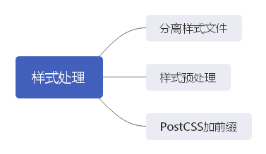

除了 JavaScript 以外，在打包方面另一个重要的工作就是样式处理。在具有一定规模的工程中，由于手工维护CSS成本过于高昂，我们可能需要更智能的方案来解决浏览器兼容性问题，更优雅地处理组件间的样式隔离，甚至是借助一些更强大的语言特性来实现各种各样的需求。



[[toc]]

## **配置loader**

那么我们只有配置了相关的 loader 之后呢，才可以将 css 文件进行打包，否则是无法对 css 进行操作的，因为 webpack 只处理 JS。而要配置相关的 loader 就又需要对应的配置文件——webpack.config.js。

它的作用就是指示 webpack 干哪些事情，即当你运行 webpack 指令时，会加载里面的配置。

所有的构建工具都是基于 nodejs 平台运行的，而且模块化默认采用 commonjs。

```javascript
// webpack.config.js

// 用来拼接绝对路径的方法
const { resolve } = require('path');  // nodejs模块

module.exports = {
    // webpack 配置
    entry: './src/index.js',   // 入口起点
    output: {				  // 输出
        filename: 'built.js',  // 输出文件名，如果要在输出到指定的目录中—— 'js/build.js'
        path: resolve(__dirname, 'build')  // __dirname是nodejs的变量，代表当前文件的目录绝对路径
    },
    module: {				  // loader 配置
        rules: [
            // 详细loader的配置
            {
                // 匹配哪些文件
                test: /\.css$/,
                use: [
                    // use 数组中loader的执行顺序，是从右到左，或从下到上依次执行
                    // 创建 style 标签，将 js 中的样式资源插入进去，添加到 head 中生效
                    'style-loader',
                    // 将 css 文件变成 commonjs 模块加载到js中，里面内容是样式字符串
                    'css-loader'
                ]
            },
            {
                test: /\.scss$/,
                use: [
                    'style-loader',
                    'css-loader',
                    'scss-loader'
                ]
            }
        ]
    },
    plugins: [  			  // plugins插件的配置
        // 详细 plugins 的配置
    ],
    mode: 'development' 		// 开发模式
}
```

那么说了这么多，如何对css文件进行打包呢——这里需要 css-loader.

```shell
npm i css-loader style-loader -D
```

安装好之后，在命令行直接输入 `webpack` 指令即可。

然后对应打包的输出路径 build 目录中，我们先手动新建一个 index.html，并在里面引入打包后生成的 js，然后打开 html 文件可以发现样式已经被插入到了页面当中。

而如果我们要对less或者 scss文件进行打包也是一样的，需要安装对应的 loader。

```shell
npm i scss-loader node-sass -D

npm i less-loader less -D
```

scss-loader需要对应的 node-sass，但是node-sass这个包很大，在下载安装时容易出现超时，所以之后又出现了 dart-sass。

## **分离样式文件**

## **样式预处理**

## **PostCSS加前缀**

