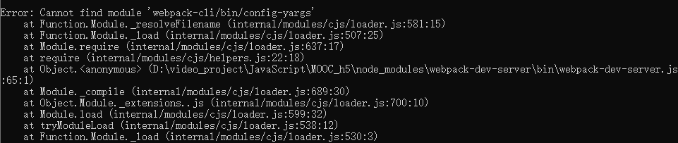
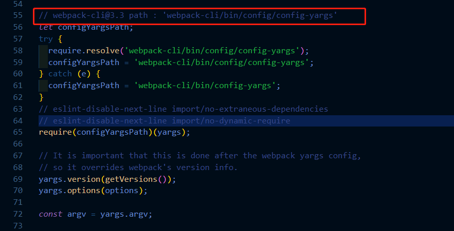

在使用webpack的时候，我们会遇到webpack-cli与webpack-dev-server两个之间版本不匹配的问题，然而又对两个版本之间哪两个相匹配一头雾水，这里其实我们在启动webpack-dev-server的时候，如果出现不匹配的问题，会明确给我们指出来，我们只要顺着去找就OK了。

比如现在我启动webpack-dev-server的时候报错了，报错信息如下：



可以看到，提示在 node_modules目录下的 webpack-dev-server 中有一个bin目录，而正是这个目录里的 webpack-dev-server.js 文件里的第65行抛出的错误，那么我们进入到这个文件中去查看一下：



简直一目了然有没有，我的天，重新安装 webpack-cli，开搞！

当然在webpack5中，我们安装了webpack-dev-server，版本为3.11.0。这里我们的启动配置就需要修改一下，不再是之前的 `webpack-dev-server`了，而是：

```shell
webpack serve

# 要打开浏览器
webpack serve --open Chrome.exe
```

那么webpack-dev-server的作用是为了什么呢？

1. 在没有使用 webpack-dev-server 之前，每次修改源代码都需要重新执行一遍打包命令，效率很低
2. 想在更改代码后即可在网页上看到最新的修改效果
3. 避免每次修改源代码都要进行打包和手动刷新页面
4. 帮助开发者自动打包
5. 自动编译，自动打开浏览器，自动刷新浏览器

::: tip

**特点**：只会在内存中编译打包，不会有任何输出。

:::

我们称它为开发服务器，在配置文件中是这样的：

```javascript
module.exports = {
    ...
    devServer: {
        // 运行项目目录，即构建后的目录
        contentBase: resolve(__dirname, 'build'),
        // 启动 gzip 压缩
        compress: true,
        port: 3000,
        open: true,
        publicPath: ''
    }
    ...
}
```

如果是本地安装，那么启动的时候输入：

```shell
npx webpack-dev-server
```

这样进程不会结束，会监听源码的改变而刷新页面。当退出服务后，进程结束，内存中的内容被删除。

接下来我们大概会说下我们经常会用到的几个配置项：

- contentBase

  - 这个配置项的作用是告诉服务器内容的来源。仅在需要提供静态文件时才进行配置。建议使用绝对路径来进行设置。默认情况下，它将使用当前的工作目录来提供内容。如果要禁用 `contentBase`，只需要将其设置为 `false` 即可。
  - 因为 webpack-dev-server 默认会将构建结果和输出文件全部作为开发服务器的资源文件，也就是说，只要通过 webpack 打包能够输出的文件都可以直接被访问。但是如果你还有一些没有参与打包的静态文件也需要作为开发服务器的资源被访问，那么就需要配置这个参数。
  - 可以是一个字符串或数组。

  ::: tip

  在实际使用 webpack 时，我们一般会使用 copy-webpack-plugin 插件来将静态资源文件输出到输出目录。但是其实在开发阶段，我们是不会使用到的，因为开发阶段会很频繁的重复执行打包任务，假设这个目录下需要拷贝的文件比较多，如果每次都需要执行这个插件，那打包过程开销就会比较大，每次构建的速度也就自然会降低。

  :::

- watchContentBase

  - 告诉 dev-server 监听 [`devServer.contentBase`]选项提供的文件。 默认情况下禁用。 启用后，文件更改将触发整个页面重新加载。说白了就是监视 contentBase 目录下的所有文件，一旦文件变化就会 reload。
  - 和 contentBase 绑定在一起。

- watchOptions

  - ignored：监视文件时选择要忽略的文件，一般会忽略掉 node_modules 目录。

- pubilcPath

  - 默认值是`/`，表示devServer这个服务器在以`contentBase`为根路径的基础上，再以 `publicPath` 为对外开放的路径。主要是对外提供开发过程中 webpack 构建的文件。即**决定外部能以什么样的路径访问到构建文件**。
  - 当然，webpack 构建的文件是在内存中的，而不是在电脑磁盘上，如果内存中找不到想要的文件时，devServer 会根据文件的路径尝试去电脑磁盘上去找。
  - 如果开发时存在内存和 contentBase 下真实的磁盘路径中存在着同样文件名的文件，那么， devServer 会返回内存的那个。
  - ***确保* `devServer.publicPath` *始终以正斜杠开头和结尾。***
  - ***建议* `devServer.publicPath` *与* [`output.publicPath`](https://webpack.docschina.org/configuration/output/#outputpublicpath) *相同。***

- compress：开启 gzip 压缩。

- proxy

  - 在项目中我们会经常用到 proxy 代理。默认是个 `Obejct`

    ```javascript
    module.exports = {
      //...
      devServer: {
        proxy: {
          '/api': 'http://localhost:3000'
        }
        /*
        proxy: {
          '/api': {
          	target: 'http://localhost:3000',
          	pathRewrite: {'^/api' : ''}
          }
        }
        */
      }
    };
    ```

    如上代码块，使用后端在 `localhost:3000` 上，可以使用它来启用代理。现在，对 `/api/users` 的请求会将请求代理到 `http://localhost:3000/api/users`上去。而如果不希望传递`/api`，也可以选择重写路径。上面代码块实际请求的路径是`http://localhost:3000/users`，后面的 pathRewrite 实际上把 api 重写为了空。

    需要注意的是，我们这里也要解决一下跨域问题——在 proxy 中，我们通过设置 `changeOrigin` 来解决跨域问题：

    ::: tip

    默认情况下，代理时会保留主机头的来源，也就是说请求头中的host仍然是浏览器发送过来的host，而不是我们设置的 target。当然这句话的意思并不是说我们在设置 `changeOrigin` 为 `true` 之后，就可以在控制台看到请求头的host是我们设置的 target了。而是说，你在前台看到的请求仍然是你主机头来源，但是实际上在后台进行**request.getHeader("Host")**打印时，可以清楚的看到请求头就是 target 配置对应的路径。

    **我们可以理解为浏览器显示的是我们发送给代理服务器的请求，而后端接收到的是代码服务器处理后的请求。**

    :::
    
  - 适用在开发环境，如果是在生产环境，需要在 nginx 上设置代理，如果不涉及跨域，就不需要设置。

- open

  - 项目启动后，自动打开浏览器（默认浏览器）。必须设置为 true，默认是 false。或者也可以直接设置要使用的浏览器名称，如`Google Chrome`

- inline

  - 在开发服务器的两种不同模式之间切换。默认情况下，开启**inline模式**。这表示如果bundle有更新，就可实时重新加载，并将构建消息展示在浏览器控制台中。

- port

  - 指定启动项目后的服务端口号，默认是 8080.

- liveReload

  - 默认情况下，检测到文件更改时，开发服务器将重新加载/属性页面。前提是**必须禁用`devServer.hot`选项或者必须启用`watchContentBase`选项才能使其生效**。

- host

  - 指定要使用的 `host`。默认是 `localhost`。当然，如果希望外部也能访问服务器，可将其设置为 `0.0.0.0`

- hot

- clientLogLevel

  - 是否显示启动服务器以后的日志信息，将在下个版本弃用。

- quiet

  - 除了一些基本启动信息以外，其他内容都不要显示。

- overlay

  - 出错提示是否在浏览器中全屏展示。

**问题**：

1. 当设置了 `output.publicPath` 后，liveReload 失效，为什么？