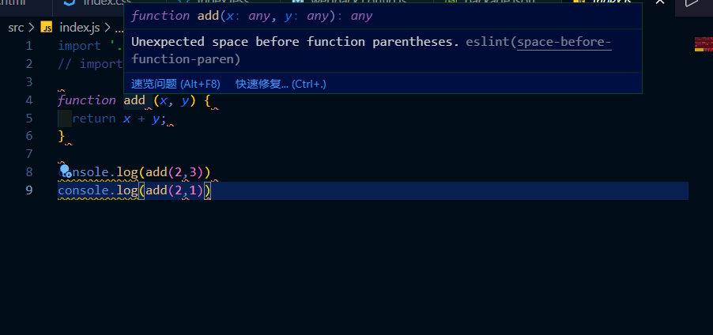

所谓语法检查，意指在团队协作开发时，我们的代码风格是能保持一致的，并且要避免掉一些语法错误，而这个时候我们就可以使用到 js 的语法检查**eslint**，通过它来保证写法及风格的一致性，从而保证代码质量及可维护性。

在 webpack 中使用 eslint ，需要安装 `eslint-loader`，而 `eslint-loader` 呢，又依赖于 `eslint` 这个库，所以首先就要安装它们。

```shell
npm i eslint-loader eslint -D
```

安装好之后，就可以在 webpack 的配置文件中去进行配置：

```js
// webpack.config.js
module.exports = {
    ...
    module: {
        rules: [
            /*
            语法检查 eslint-loader eslint
            */
            {
                test: /\.js$/,
                exclude: /node_modules/,
                loader: 'eslint-loader',
                options: {}
            }
        ]
    }
    ...
}
```

这里我们是对 js 进行语法检查的，所以需要匹配的文件是 JS 文件，而且对于 node_modules 目录来说，我们是不检查的，因为一般我们只检查自己写的源代码，而第三方的库是不用检查的。

那这些配置好之后呢，我们还需要设置检查规则，既然是语法检查，那没有一个规则来作为标准，eslint 也不知道怎么去检查你的代码，所以我们还需要在 `package.json` 文件中再添加一个 `eslintConfig` 的配置项。

推荐大家使用 `airbnb` 规则，因为这个在 github 上的排名是很靠前的，而且里面会告诉你，这块的代码该如何去写。（Star 量将近10W）

那么怎么将其运用到我们的项目中去呢，首先打开 https://www.npmjs.com/ ，然后搜索 `eslint-config-airbnb-base`。其实还有一个是 `eslint-config-airbnb`，那这个里面会包含 `react` 的语法风格，所以我们不去选它，选第一个就可以了。

而 `eslint-config-airbnb-base` 又分为两种：

1. eslint-config-airbnb-base：包含 ES6 及以上的语法。

2. eslint-config-airbnb-base/legacy：只包含 ES5 及以下的语法。

我们肯定是要使用第一种，所以这里需要再去安装一下：

```shell
npm i eslint-config-airbnb-base -D
```

而在 npmjs 里我们还看到 `It requires `eslint` and `eslint-plugin-import`.`意思是还依赖与 eslint 和 eslint-plugin-import 两个库，我们继续安装。

```shell
npm i eslint-plugin-import -D
```

下载安装完成后，我们在 `package.json` 中去配置：

```json
{
    "eslintConfig": {
        "extends": "airbnb-base"
    }
}
```

这样的话就会继承 `airbnb-base` 所提供的规则检查。

此时再去看项目中的 JS 文件会发现，如果有不规范的写法，IDE 这里会提示你语法有误：



那么这么多错误，一个个修复的话，会很麻烦，所以我们可以在配置文件中去添加一项配置：

```js
// webpack.config.js
module.exports = {
    ...
    module: {
        rules: [
            /*
            语法检查 eslint-loader eslint
            */
            {
                test: /\.js$/,
                exclude: /node_modules/,
                loader: 'eslint-loader',
                options: {
                    fix: true    // 自动修复eslint错误
                }
            }
        ]
    }
    ...
}
```

这样的话，当再次运行 webpack 命令的时候，eslint 会自动修改这些报错，只留下一些警告。

如果想要忽略某个页面的某个警告，可以在警告的上面一行加一个注释：

```js
// eslint-disable-next-line
console.log(add(2, 5))
```

因为 airbnb 不推荐在代码中使用 console，所以这里就会抛出警告。