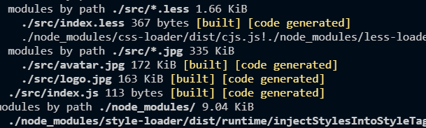
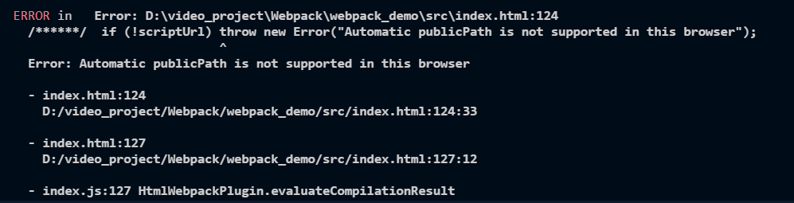

首先在 webpack 中是没有办法去处理图片的，我们必须借助 loader 的力量去对图片进行打包。url-loader 是依赖于 file-loader 的，所以我们要下载两个包。

```shell
npm i url-loader file-loader -D
```

然后在 webpack.config.js 去配置：

```javascript
module.exports = {
    ...
    module: {
        rules: [
            {
                test: /\.(jpg|png|gif)$/,
                // 使用一个 loader 的时候，直接用 loader即可，使用多个用 use
                loader: 'url-loader',
                // 图片大小小于8kb，就会被 base64 处理
          		// 优点：减少请求数量，减轻服务器压力
          		// 缺点：图片体积会更大，文件请求更慢
                options: {
                    limit: 8 * 1024,
                    // 因为url-loader 默认使用 es6 模块化解析，而 html-loader 引入图片是 commonjs
                    // 解析时会出现 [object Module]
                    // 解决：关闭 url-loader 的 es6 模块化，使用commonjs 解析
                    esModule: false,
                    // 给图片进行重命名——hash长度限制10位
                    // ext 取原来的扩展名
                    name: '[hash:10].[ext]',
                    // 输出到指定目录里
                    outputPath: 'imgs'
                }
            }
        ]
    }
    ...
}
```

以上配置就可以将 css 里的背景图打包到 build.js 中去。



但是如果只做了如上配置是不行的，因为它只会打包 css 文件里的图片，如果是页面 img 标签里的图片，还需要加入其它配置：

```javascript
module.exports = {
    module: {
        rules: [
            {
                test: /\.html$/,
                // 处理 html 文件的 img 图片（负责引入 img, 从而能被 url-loader 进行处理）
                loader: 'html-loader'
            }
        ]
    }
}
```

那么这里打包的时候，如果抛出这个异常：



看这个异常就可以知道，这是因为我们在出口配置的时候，没有配置 publicPath，即静态资源访问路径。也就是给打包后的资源引入的路径前缀。

最终的资源访问路径：`output.publicPath`+资源 loader 或插件等配置路径。

现在我们去配置一下：

```javascript
module.exports = {
    ...
    output: {
        publicPath: '/build/'
    }
    ...
}
```

再去执行打包命令，就可以了。