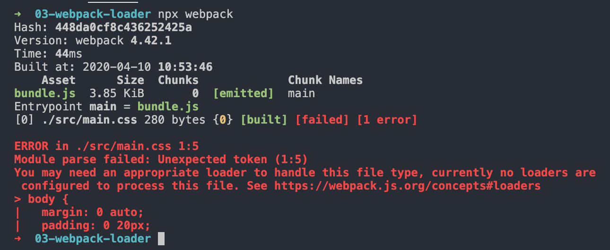

本文为笔者笔记，支持原创，[传送门](https://kaiwu.lagou.com/course/courseInfo.htm?courseId=550#/detail/pc?id=5278)

[[toc]]

## Loader 是什么？

我们经常会在 webpack 中引入各种 loader 来处理各种不同类型的资源，比如css-loader，file-loader，html-loader，那么这些loader的作用就是实现特殊资源加载。它们的本质其实就是一个函数，在函数内部对一些对应的文件做了处理。

那么webpack实现不同类型资源模块加载的核心就是 Loader。

## 如何加载资源模块？

首先，我们来看一个现象，在一个前端项目中，我们引入了 webpack，然后在配置中的入口文件路径指定为一个 css 的文件路径。让 webpack 直接打包 css 资源文件。

```javascript
module.exports = {
    // 样式文件路径
    entry: './src/index.css',
    output: {
        filename: 'bundle.js'
    }
}
```

::: tip

webpack 并没有强制要求我们必须以 JS 作为打包入口，只是在绝大多数情况下，我们会用 JS 文件作为打包入口，因为 JS  文件才是程序的逻辑入口，以 JS 文件作为入口相对更加合理。

::::

配置完成后，执行打包命令：



可以看到，在解析模块过程中遇到了非法字符，而且错误出现的位置就是在我们的CSS 文件中。

为什么会出现这种错误？

因为 webpack 内部**默认只能处理 JS 模块代码**。也就是说它会把所有遇到的文件都当做 JavaScript 代码进行解析，如果遇到不符合 JavaScript 语法的，就会抛出异常。

再继续看这句提示：`You may need an appropriate loader to handle this file type, currently no loaders are configured to process this file.`。什么意思呢？它的意思是我们需要一个加载器来处理这种文件类型，但是你现在并没有配置一个可以用来处理此文件的加载器。

所以：**Webpack 内部默认只能处理 JS 模块，如果需要加载其他类型的模块就需要配置不同的 Loader，而这个 loader 就是用来处理对应模块的**。

## 加载器的使用方式

以 css-loader 为例。

首先，我们需要安装这个 loader ：

```shell
npm install css-loader --save-dev
# or yarn add css-loader --dev
```

然后再去配置文件里使用：

```javascript
// ./webpack.config.js
module.exports = {
    entry: './src/index.css',
    output: {
        filename: 'bundle.js'
    },
    modules: {
        rules: [
            {
                test: /\.css$/,
                use: 'css-loader'
            }
        ]
    }
}
```

在配置对象的 module 属性中添加一个 rules 数组。这个数组就是我们针对资源模块的加载规则配置，其中的每个规则对象都需要设置两个属性：

- **test**：正则表达式，用来匹配打包过程中所遇到的文件路径。
- **use**：用来指定匹配到的文件需要使用的 loader，这里用到的是 css-loader。当然这里也可以直接使用模块文件的路径。

配置完之后，再重新打包就不会出错了。打包流程如下：

```md
CSS ——> css-loader ——> webpack —— bundle.js
```

当然，这里的用法也不是就这么简单的，还是以 css 为例。那么这里配置完之后，我们只是做了 CSS 的转换，即将 CSS 代码转换为一个 JS 模块，然后 push 到一个数组中去，而这个数组是由 css-loader 内部的一个模块提供的，并没有在项目中去使用。所以这里还需要一个 style-loader，需要将它通过 style 标签动态追加到页面上去。

这里有一点注意的是，安装完 style-loader 之后，我们就将配置文件中的 use 属性改为一个数组，将 style-loader 也放进去。

::: tip

一旦配置多个 Loader，**执行顺序是从后往前执行的**，所以这里一定要将 css-loader 放在最后。即把**转换的loader**放在最后。

:::

## oneOf

之前在项目中，每个文件都会被多个 `loader` 挨个儿都过一遍，这其实对于一些特殊资源来说是比较麻烦并且是多余的。那么我们这里使用 `oneOf` 来优化这里的执行流程以及构建速度：

```js
module.exports = {
    ...
    module: {
        rules: [
            /**
           * 正常来讲，一个文件只能被一个 loader 处理，
           * 当一个文件要被多个 loader 处理，那么一定要指定 loader 执行的先后顺序
           *   先执行 eslint ，再执行 babel，因为 eslint 是做语法检查的，如果语法错误，
           * 那就不用再往下了，而且 babel 是做语法转换的，会把 ES6转成ES5，这个时候再去做
           * eslint ，就会报错，比如提示你不要使用 var 关键字
           */
          {
            // 在 package.json 中添加 eslintConfig  --> airbnb
            test: /\.js$/,
            exclude: /node_modules/,
            // 优先执行的意思
            enforce: 'pre',
            loader: 'eslint-loader',
            options: {
              // 自动修复出现的问题
              fix: true
            }
          },
          {
              oneOf: [
                  {
            test: /\.css$/,
            use: [...commonCssLoader]
          },
          {
            test: /\.less$/,
            use: [
              ...commonCssLoader,
              'less-loader'
            ]
          },
          {
            // 在 package.json 中添加 eslintConfig  --> airbnb
            test: /\.js$/,
            exclude: /node_modules/,
            loader: 'babel-loader',
            options: {
              // 预设
              presets: [
                [
                  '@babel/preset-env',
                  {
                    useBuiltIns: 'usage',
                    corejs: { version: 3 },
                    targets: {
                      chrome: '60',
                      firefox: '50'
                    }
                  }
                ]
              ]
            }
          },
          {
            test: /\.(jpg|png|gif)$/,
            loader: 'url-loader',
            options: {
              limit: 8 * 1024,
              name: '[hash:10].[ext]',
              output: 'imgs',
              esModule: false
            }
          },
          {
            // HTML 中的图片问题
            test: /\.html$/,
            loader: 'html-loader'
          },
          {
            // 处理其他文件
            exclude: /\.(js|css|less|html|jpg|png|gif)$/,
            // 原封不动的输出文件
            loader: 'file-loader',
            options: {
              // 让输出的目录到 media下去
              outputPath: 'media'
            }
          }
              ]
          }
        ]
      },
    ...
}
```

也就是说，经过 `oneOf` 配置之后呢，里面的 loader 只会匹配一个，一旦匹配到对应的文件后，就不再会去走其他的 loader 了。

::: tip

注意：我们在使用 oneOf 之后，不能又两项配置处理同一种类型的文件。所以我们将 eslint-loader 提取到了外面。

:::

## 为什么要在JS 中加载其他资源

做一个假设：假设我们在开发页面上的某个局部功能时，需要用到一个样式模块和一个图片文件。如果你还是将这些资源文件单独引入到 HTML 中，然后再到 JS 中添加对应的逻辑代码。试想一下，如果后期这个局部功能不用了，你就需要同时删除 JS 中的代码和 HTML 中的资源文件引入，也就是同时需要维护这两条线。而如果你遵照 Webpack 的这种设计，所有资源的加载都是由 JS 代码控制，后期也就只需要维护 JS 代码这一条线了。

所以说，通过 JavaScript 代码去引入资源文件，或者说是建立 JavaScript 和资源文件的依赖关系，具有明显的优势。因为 JavaScript 代码本身负责完成整个应用的业务功能，放大来说就是驱动了整个前端应用，而 JavaScript 代码在实现业务功能的过程中需要用到样式、图片等资源文件。如果建立这种依赖关系：

- 一来逻辑上比较合理，因为 JS 确实需要这些资源文件配合才能实现整体功能；
- 二来配合 webpack 这类工具的打包，能确保在上线时，资源不会缺失，而且都是必要的。

## 开发一个 Loader

每个 webpack 的 loader  都需要导出一个函数，这个函数就是我们这个 Loader 对资源的处理过程，它的输入就是加载到的资源文件内容，输出就是我们加工后的结果。