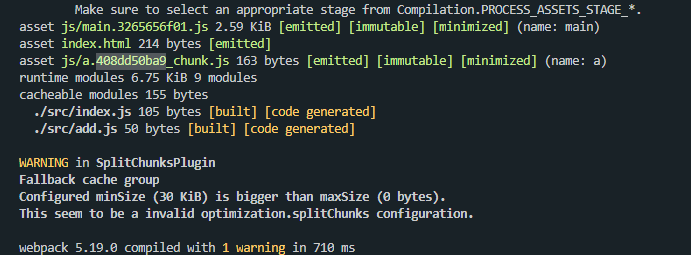
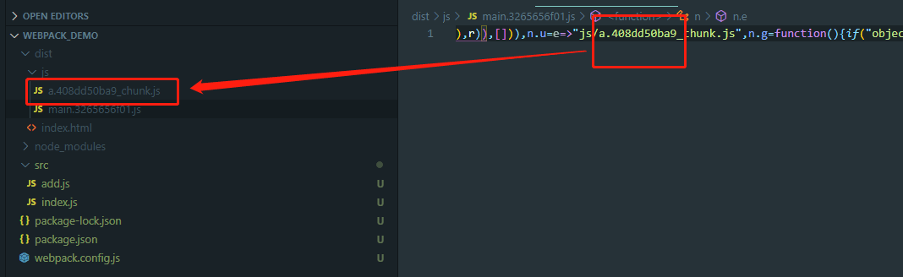

 那么对于 optimization 来说，是要对生产环境做一些优化的配置，所以我们一般会在生产环境也就是 `mode: production` 时使用它。

## splitChunks：代码分割

- chunks：'async'，分包规则，默认是 async

- minSize：30 * 1024，分割的 chunk 最小体积为30KB

- maxSize：0，最大没有限制

- minChunks：1，要提取的 chunk 最少被引用1次

- maxAsyncRequests：5，按需加载时并行加载的文件的最大数量

- maxInitialRequests：3，入口 js 文件最大并行请求数量

- automaticNameDelimiter：'~'，名称连接符

- name: true，可以使用命名规则

- cacheGroups：分割 chunk 的组，里面的配置可以是上述的配置项，会覆盖掉外层的配置项的值。

  ```js
  cacheGroups: {
      // node_modules 文件会被打包到 vendors 组的 chunk 中。打包以后生成的文件名 vendors~xxx.js， ~ 就是上面说的连接符
      // 满足上面的公共规则，如：大小超过 30kb，至少被引用一点
      vendors: {
          test: /[\\/]node_modules[\\/]/,
          // 优先级
          priority: -10
      },
      default: {
      	// 要提取的 chunk 最少被引用2次
          minChunks: 2,
          // 优先级
          priority: -20,
          // 如果当前要打包的模块，和之前已经被提取的模块是同一个，就会复用，而不是重新打包模块
          reuseExistingChunk: true
      }
  }
  ```

但是此时还有一个问题，我们来看下：

1. 入口文件 index.js 引入一个 js 文件为 a.js
2. 打包以后生成两个js 文件

```js
module.exports = {
    entry: './src/index.js',
    output: {
        filename: 'js/[name].[contenthash:10].js',
        path: resolve(__dirname, 'dist'),
        chunkFilename: 'js/[name].[contenthash:10]_chunk.js'
    },
    module: {
        rules: []
    },
    plugins: [
        new HtmlWebpackHtml()
    ],
    mode: 'production',
    optimization: {
        splitChunks: {
            chunks: 'all',
            minSize: 30 * 1024,
            maxSize: 0,
            minChunks: 1,
            maxAsyncRequests: 5,
            maxInitialRequests: 3,
            automaticNameDelimiter: '~',
            name: true,
            cacheGroups: {
                vendors: {
                    test: /[\\/]node_modules[\\/]/,
                    priority: -10
                },
                default: {
                    minChunks: 2,
                    priority: -20,
                    reuseExistingChunk: true
                }
            }
        }
    }
}
```

打包后的产物，入下图：



可以看到文件名上会生成一个 contenthash，而这个 hash 呢，其实在打包后的 main.js 中也存了一份:



那按理说，我们现在改变了 add.js 文件，index.js 文件应该是不会变的。但是由于在 main.js 中存了一份 hash 值（因为index.js 作为主文件，要引入 add.js ，所以将这个 hash 值给存下来了），从而导致修改了 add.js 后，当前的 hash 值也就变了，而当前的 hash 值一变，main.js 的 hash 值也会改变，进而导致**缓存失效**。

解决办法：

- 将 main.js 中记录的 hash 值提取出来，单独打包。

## runtimeChunk

会为每个只含有 runtime 的入口添加一个额外的 chunk。

```js
optimization: {
    runtimeChunk: {
        name: entrypoint => `runtime~${entrypoint.name}`
    }
}
```

也就是说会将当前模块记录的其他模块的 hash 值单独打包为一个文件 --> runtime。

那么再次打包之后就会生成一个运行时的 runtime 文件用来被对应的chunk共享，而 main 文件中就没有那个 hash 值了。而此时修改某个文件的时候，只有该文件和对应的 runtime 文件改变，其他模块不会被重新打包，从而保证其他模块的缓存持久化。

## minimizer

允许提供一个或者多个定制过的 TerserPlugin 实例，**覆盖默认的压缩工具**(minimizer)。也就是说这里我们要自己安装 terser-webpack-plugin 这个压缩插件去进行压缩配置，从而覆盖掉默认的配置。

```js
const TerserWebpackPlugin = require('terser-webpack-plugin')

module.exports = {
    optimization: {
        // 配置生产环境的 js 和 css 压缩方案
        minimizer: [
            new TerserWebpackPlugin({
                // 开启缓存，压缩之后可以走缓存，下次打包就会快一点
                cache: true,
                // 开启多进程打包
                parallel: true,
                // 如果需要 sourcemap ，一定要调为 true，否则会被压缩掉
                sourceMap: true
            })
        ]
    }
}
```

