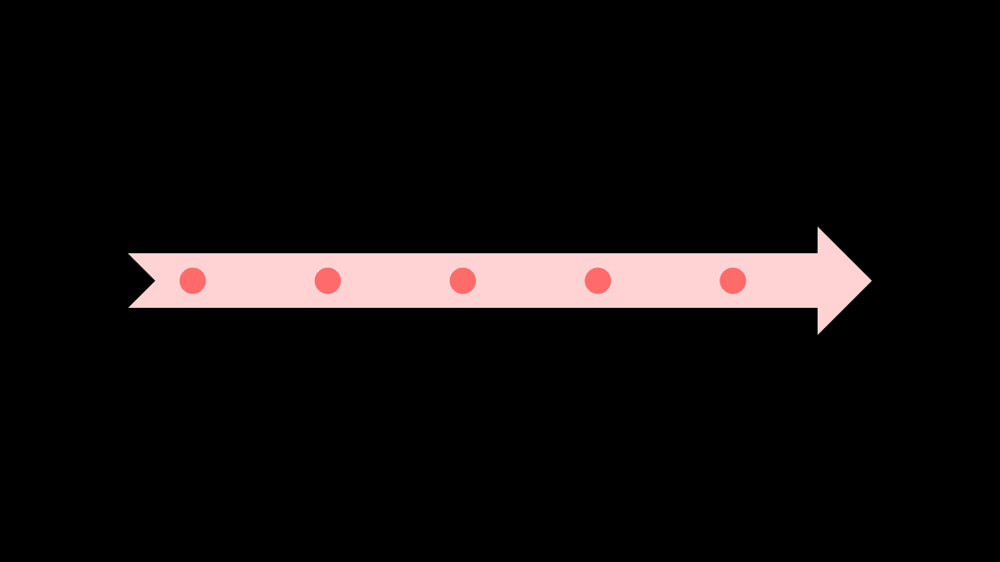
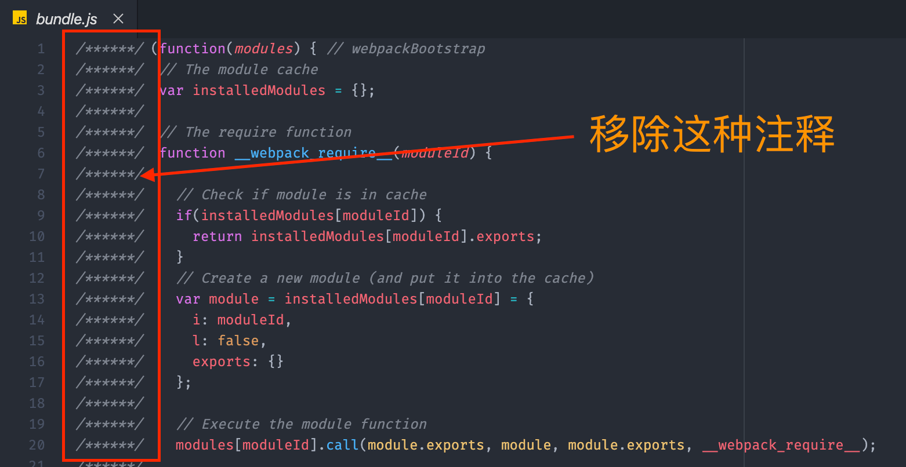
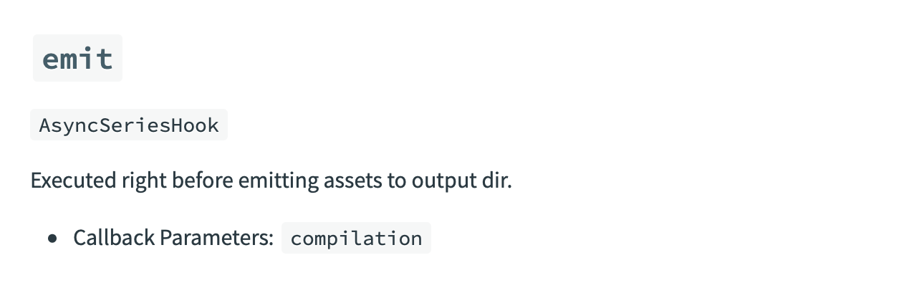
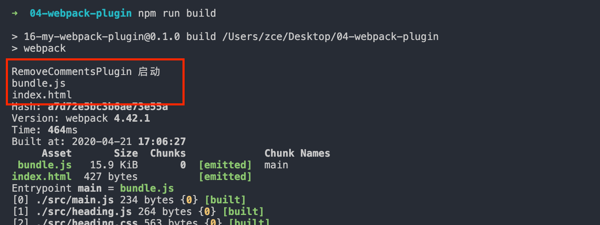
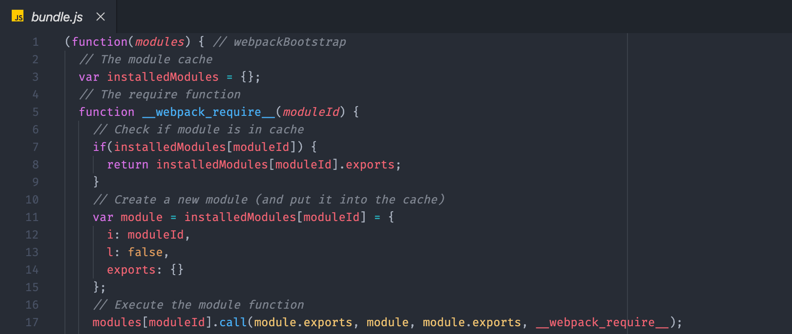

本文为笔者笔记，支持原创，[传送门](https://kaiwu.lagou.com/course/courseInfo.htm?courseId=550#/detail/pc?id=5279)

[[toc]]

webpack 插件机制的目的是为了增强 webpack 在项目自动化构建方面的能力。

我们常见的几种应用场景有：

- 实现自动打包之前删除 dist 目录；
- 自动生成应用所需要的HTML文件；
- 根据不同环境为代码注入类似API地址这种可能变化的部分；
- 拷贝不需要参与打包的资源文件到输出目录；
- 压缩 webpack 打包完成后的输出文件；
- 自动发布打包结果到服务器实现自动部署。

## 体验插件机制

### 自动清除输出目录的插件

webpack 每次打包的结果都是直接覆盖到 dist 目录。而在打包之前，dist 目录中就可能已经存入了一些在上一次打包操作时遗留的文件，当我们再次打包时，只能覆盖掉同名文件，而那些已经移除的资源文件就会一直累积在里面，最终导致部署上线时出现多余文件，这显然非常不合理。

那么最好是每次打包都把上次的 dist 目录删除，这样每次打出来的包就是最新的，而不会有其他积累的无用的、废弃的文件。

**clean-webpack-plugin**这个插件很好的实现了这一需求。我们先来安装一下：

```shell
npm install clean-webpack-plugin --save-dev
```

然后，我们回到 webpack 的配置文件中，导入 clean-webpack-plugin 插件，这个插件模块导出了一个 CleanWebpackPlugin 的成员，我们先把它解构出来。

```javascript
// ./webpack.config.js
const { CleanWebpackPlugin } = require('clean-webpack-plugin')

module.exports = {
    entry: './src/main.js',
    output: {
        filename: 'bundle.js'
    },
    plugins: [
        new CleanWebpackPlugin()
    ]
}
```

这样我们再次打包的时候，就会看到之前的包会被自动删掉了。最后的 dist 包就是本次打包的产物。

一般来说，当我们有了某个自动化的需求之后，可以先去找到一个合适的插件，最后将它配置到 webpack 配置对象的 plugins 数组中，这个过程唯一有可能不一样的地方就是有的插件会需要配置一些配置参数。

### 用于生成 HTML 的插件

除了自动清理 dist 目录，我们还有一个非常常见的需求，就是自动生成使用打包结果的 HTML，所谓使用打包结果指的是在 HTML 中自动注入 webpack 打包生成的 bundle。

为什么要使用这个插件？

1. 在没有使用插件之前，我们的HTML文件一般都是通过硬编码的形式，单独存放在项目根目录下的，这样的话，在项目发布时，我们需要同时发布根目录下的 HTML 文件和 dist 目录中所有的打包结果，非常麻烦，而且上线过后还要确保 HTML 代码中的资源文件路径是正确的。
2. 如果打包结果输出的目录或者文件名称发生变化，那 HTML 代码中所对应的 script 标签也需要我们手动修改路径。

解决这两个问题最好的办法就是让 Webpack 在打包的同时，自动生成对应的 HTML 文件，让 HTML 文件也参与到整个项目的构建过程。这样的话，在构建过程中，Webpack 就可以自动将打包的 bundle 文件引入到页面中。

那么它的优势就很明显：

1. HTML 也能输出到 dist 目录中，上线时我们只需要把 dist 目录发布出去就可以了；
2. HTML 中的 script 标签是自动引入的，所以可以确保资源文件的路径是正常的。

那么实现这一需求的插件就是——html-webpack-plugin。同样需要单独安装这个模块：

```shell
npm install html-webpack-plugin --save-dev
```

安装完成之后，去配置文件进行引入：

```javascript
// ./webpack.config.js
const HtmlWebpackPlugin = require('html-webpack-plugin')
const { CleanWebpackPlugin } = require('clean-webpack-plugin')

module.exports = {
    entry: './src/main.js',
    output: {
        filename: 'bundle.js'
    },
    plugins: [
        new CleanWebpackPlugin(),
        new HtmlWebpackPlugin()
    ]
}
```

这样再次进行打包的时候，就会自动生成一个 index.html 文件到 dist 目录中去。而这个文件的内容就是一段使用了 bundle.js 的空白 HTML。

但让这里仍然存在一些需要改进的地方：

- 对于生成的 HTML 文件，页面 title 必须要修改；
- 很多时候还需要我们自定义页面的一些 meta 标签和一些基础的 DOM 结构。

对于以上问题，如果是简单的自定义，我们可以通过修改 HtmlWebpackPlugin 的参数来实现。

在配置文件中，我们给 HtmlWebpackPlugin 构造函数传入一个对象参数，用于指定配置选项。比如配置 title 和 meta。

```javascript
// ./webpack.config.js
const HtmlWebpackPlugin = require('html-webpack-plugin')
const { CleanWebpackPlugin } = require('clean-webpack-plugin')

module.exports = {
    entry: './src/main.js',
    output: {
        filename: 'bundle.js'
    },
    plugins: [
        new CleanWebpackPlugin(),
        new HtmlWebpackPlugin({
            title: 'Webpack plugin demo',
            meta: {
                viewport: 'width=device-width'
            }
        })
    ]
}
```

那么再次打包就会根据配置项生成对应的标签和内容。

那如果是大量的自定义，更好的做法是源代码中添加一个用于生成 HTML 的模板，然后让 html-webpack-plugin 插件根据这个模板去生成页面文件。

那么这个模板怎么去做呢？

很简单，直接在 src 目录下新建一个 index.html 文件作为 HTML 文件的模板，然后再在里面添加相应的元素。对于模板中动态的内容，可以使用 Lodash 模板语法输出，模板中可以通过 htmlWebpackPlugin.options 访问这个插件的配置数据。比如我们这里输出配置中的 title 属性：

```html
<!-- ./src/index.html -->
<!DOCTYPE html>
<html lang="en">
<head>
  <meta charset="UTF-8">
  <meta name="viewport" content="width=device-width, initial-scale=1.0">
  <meta http-equiv="X-UA-Compatible" content="ie=edge">
  <title><%= htmlWebpackPlugin.options.title %></title>
</head>
<body>
  <div class="container">
    <h1>页面上的基础结构</h1>
    <div id="root"></div>
  </div>
</body>
</html>
```

有了模板之后，我们就可以在 htmlWebpackPlugin 中的 template 属性里去配置：

```javascript
// ./webpack.config.js
const HtmlWebpackPlugin = require('html-webpack-plugin')
const { CleanWebpackPlugin } = require('clean-webpack-plugin')

module.exports = {
    entry: './src/main.js',
    output: {
        filename: 'bundle.js'
    },
    plugins: [
        new CleanWebpackPlugin(),
        new HtmlWebpackPlugin({
            title: 'webpack plugin demo',
            template: './src/index.html'
        })
    ]
}
```

这里还有一个问题就是项目是单页面应用程序，还是一个多页面的应用程序，如果是多页面的应用程序我们应该怎么去设置？

其实也很简单，无非就是再创建一个新的实例对象，用于创建额外的 HTML 文件。这里需要通过 `filename` 指定输出文件名，这个属性的默认值是 `index.html`，所以我们需要对这个配置项设置一下将要生成的文件名，比如 `more.html`。

```javascript
// ./webpack.config.js
const HtmlWebpackPlugin = require('html-webpack-plugin')
const { CleanWebpackPlugin } = require('clean-webpack-plugin')

module.exports = {
    entry: './src/main.js',
    output: {
        filename: 'bundle.js'
    },
    plugins: [
        new CleanWebpackPlugin(),
        // 生成 index.html
        new HtmlWebpackPlugin({
            title: 'webpack plugin demo',
            template: './src/index.html'
        }),
        // 生成 more.html
        new HtmlWebpackPlugin({
            filename: 'more.html'
        })
    ]
}
```

OK，这样再次打包就会在 dist 目录下生成 index.html 和 more.html 两个页面文件。

当然，对于同时输出多个 HTML，一般我们还会配合 webpack 多入口打包的用法，这样就可以让不同的 HTML 使用不同的打包结果。

### 用于复制文件的插件

那么我们复制文件，复制的是哪些文件呢？——一般在项目中不需要参与构建的静态文件，最终也需要发布到线上，比如 favicon等。

一般我们建议，把这类的文件统一放在项目根目录下的 public 或者 static 目录中，我们的期望是打包的时候一并将这个目录下的所有文件复制到输出目录中去。这时候我们就用到了 copy-webpack-plugin 这个插件了。

```javascript
// ./webpack.config.js
const HtmlWebpackPlugin = require('html-webpack-plugin')
const CopyWebpackPlugin = require('copy-webpack-plugin')
const { CleanWebpackPlugin } = require('clean-webpack-plugin')

module.exports = {
    entry: './src/main.js',
    output: {
        filename: 'bundle.js'
    },
    plugins: [
        new CleanWebpackPlugin(),
        // 生成 index.html
        new HtmlWebpackPlugin({
            title: 'webpack plugin demo',
            template: './src/index.html'
        }),
        // 生成 more.html
        new HtmlWebpackPlugin({
            filename: 'more.html'
        }),
        new CopyWebpackPlugin({
            patterns: ['public']  // 需要拷贝的目录或路径通配符
        })
    ]
}
```

这个插件类型的构造函数需要我们传入一个字符串数组，用于指定需要拷贝的文件路径。它可以是一个通配符，也可以是一个目录或者文件的相对路径。我们这里传入的是 public 目录，表示将这个目录下所有文件全部拷贝到输出目录中。当然了，你还可以在这个数组中继续添加其它路径，这样它在工作时可以同时拷贝。

## 开发一个插件

插件机制是如何实现的？

那么我们说插件的作用范围几乎可以触及 webpack 工作的每一个环节，既然这样，我们应该可以猜到其实 webpack 的插件机制就是我们在软件开发中最常见的钩子机制。（当然笔者是看到的。）

钩子机制有点类似于 web 中的事件。

在 webpack 整个工作过程会有很多环节，为了便于插件的扩展，webpack 几乎在每一个环节都埋下一个钩子。这样我们在开发插件的时候，通过往这些不同节点挂载不同的任务，就可以轻松扩展 webpack 的能力。



具体有哪些预先定义好的钩子，我们可以参考官方文档的 API：

- [Compiler Hooks](https://webpack.js.org/api/compiler-hooks/)；
- [Compilation Hooks](https://webpack.js.org/api/compilation-hooks/)；
- [JavascriptParser Hooks](https://webpack.js.org/api/parser/)。

接下来我们自己开发一个插件。

需求：自动清除 webpack 打包结果中的注释。



那这里我们同样在项目根目录下添加一个单独的 JS 文件。

```md
└─ 04-webpack-plugins ······················· sample root dir
    ├── public ······························· static dir
    │   └── favicon.ico ······················ static file
    ├── src ·································· source dir
    │   └── main.js ·························· entry module
    ├── package.json ························· package file
+   ├── remove-comments-plugin.js ············ my plugin
    └── webpack.config.js ···················· webpack config file
```

Webpack 要求我们的插件必须是一个函数或者是一个包含 apply 方法的对象，一般我们都会定义一个类型，在这个类型中定义 apply 方法。然后在使用时，再通过这个类型来创建一个实例对象去使用这个插件。

所以我们这里定义一个 RemoveCommentsPlugin 类型，然后在这个类型中定义一个 apply 方法，这个方法会在 Webpack 启动时被调用，它接收一个 compiler 对象参数，这个对象是 Webpack 工作过程中最核心的对象，里面包含了我们此次构建的所有配置信息，我们就是通过这个对象去注册钩子函数。

```js
// ./remove-comments-plugin.js
class RemoveCommentsPlugin {
  apply (compiler) {
    console.log('RemoveCommentsPlugin 启动')
    // compiler => 包含了我们此次构建的所有配置信息
  }
}
```

知道这些过后，还需要明确我们这个任务的执行时机，也就是到底应该把这个任务挂载到哪个钩子上。

我们的需求是删除 bundle.js 中的注释，也就是说只有当 Webpack 需要生成的 bundle.js 文件内容明确过后才可能实施。



这个钩子会在 Webpack 即将向输出目录输出文件时执行，非常符合我们的需求。

我们回到代码中，通过 compiler 对象的 hooks 属性访问到 emit 钩子，再通过 tap 方法注册一个钩子函数，这个方法接收两个参数：

- 第一个是插件的名称，我们这里的插件名称是 RemoveCommentsPlugin；
- 第二个是要挂载到这个钩子上的函数；

这里我们在这个函数中接收一个 compilation 对象参数，这个对象可以理解为此次运行打包的上下文，所有打包过程中产生的结果，都会放到这个对象中。

我们可以使用这个对象中的 assets 属性获取即将写入输出目录的资源文件信息，它是一个对象，我们这里通过 for in 去遍历这个对象，其中键就是每个文件的名称，我们尝试把它打印出来。

```js
// ./remove-comments-plugin.js
class RemoveCommentsPlugin {
  apply (compiler) {
    compiler.hooks.emit.tap('RemoveCommentsPlugin', compilation => {
      // compilation => 可以理解为此次打包的上下文
      for (const name in compilation.assets) {
        console.log(name) // 输出文件名称
      }
    })
  }
}
```

完成以后，我们将这个插件应用到 Webpack 的配置中，然后回到命令行重新打包，此时打包过程就会打印我们输出的文件名称。



我们再回到代码中，来打印一下每个资源文件的内容，文件内容需要通过遍历的值对象中的 source 方法获取。

```js
// ./remove-comments-plugin.js
class RemoveCommentsPlugin {
  apply (compiler) {
    compiler.hooks.emit.tap('RemoveCommentsPlugin', compilation => {
      // compilation => 可以理解为此次打包的上下文
      for (const name in compilation.assets) {
        // console.log(name)
        console.log(compilation.assets[name].source()) // 输出文件内容
      }
    })
  }
}
```

能够拿到文件名和文件内容后，我们回到代码中。这里需要先判断文件名是不是以 .js 结尾，因为 Webpack 打包还有可能输出别的文件，而我们的需求只需要处理 JS 文件。

那如果是 JS 文件，我们将文件内容得到，再通过正则替换的方式移除掉代码中的注释，最后覆盖掉 compilation.assets 中对应的对象，在覆盖的对象中，我们同样暴露一个 source 方法用来返回新的内容。另外还需要再暴露一个 size 方法，用来返回内容大小，这是 Webpack 内部要求的格式。

```js
// ./remove-comments-plugin.js
class RemoveCommentsPlugin {
  apply (compiler) {
    compiler.hooks.emit.tap('RemoveCommentsPlugin', compilation => {
      // compilation => 可以理解为此次打包的上下文
      for (const name in compilation.assets) {
        if (name.endsWith('.js')) {
          const contents = compilation.assets[name].source()
          const noComments = contents.replace(/\/\*{2,}\/\s?/g, '')
          compilation.assets[name] = {
            source: () => noComments,
            size: () => noComments.length
          }
        }
      }
    })
  }
}
```

完成以后回到命令行终端，再次打包，打包完成过后，我们再来看一下 bundle.js，此时 bundle.js 中每行开头的注释就都被移除了。



插件都是通过往 Webpack 生命周期的钩子中挂载任务函数实现的。