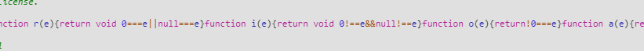
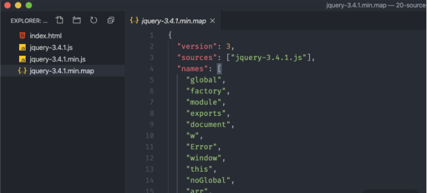
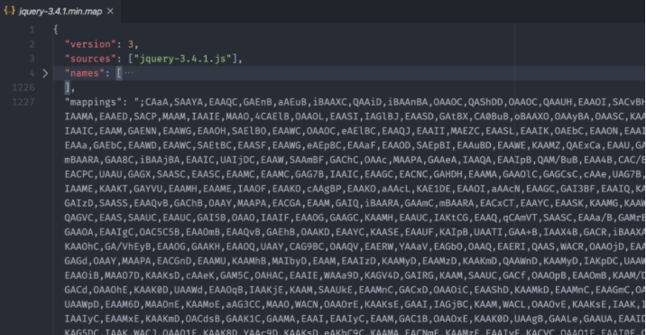
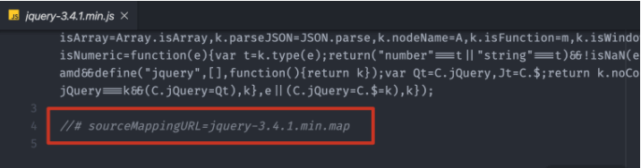
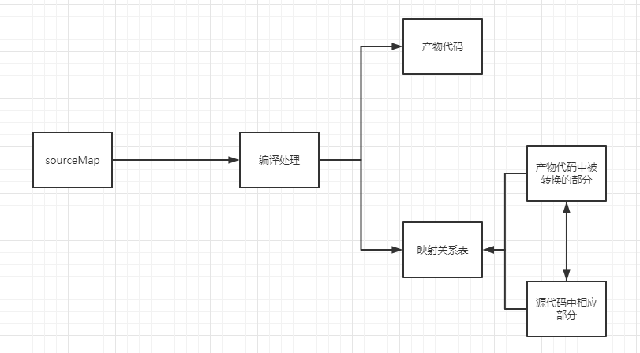
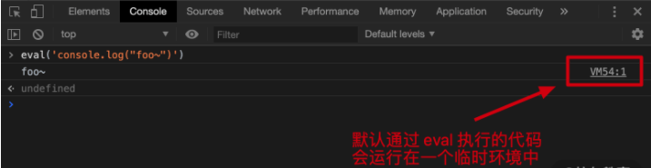
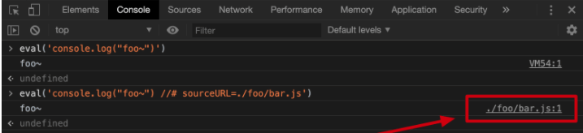
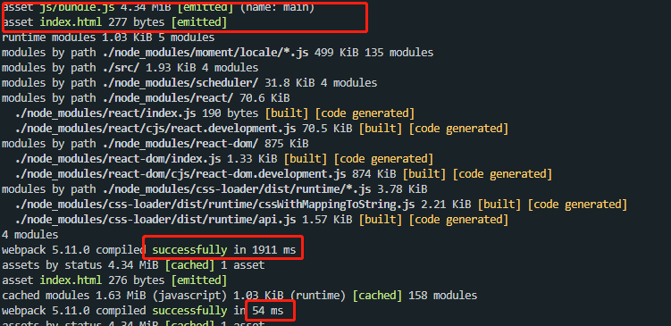
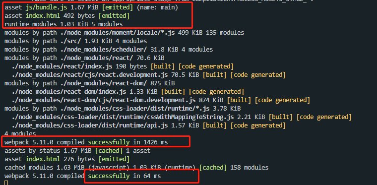

本文为笔者笔记，支持原创，[传送门](https://kaiwu.lagou.com/course/courseInfo.htm?courseId=416#/detail/pc?id=4417)

[[toc]]

## 什么是 Source Map

**SourceMap**（源代码地图）的作用：在调试的时候将产物代码显示回源代码的功能，映射转换后的代码与源代码之间的关系。

场景：通常在开发中，我们编写的代码会经过编译、封装、压缩等处理，最后形成处理过后的代码，而这种代码在浏览器中进行调试时会发现可读性很差，基本上面目全非了。



`.map` 后缀的 Source Map 文件是一个 JSON 格式的文件。这个 JSON 里面记录的就是转换后和转换前代码之间的映射关系，主要存在以下几个属性：

- version：指定所使用的 Source Map 标准版本；

- sources：记录转换前的源文件名称，因为有可能出现多个文件打包转换为一个文件的情况，所以这里是一个数组；

- names：源码中使用的一些成员名称，我们都知道一般压缩代码时会将我们开发阶段编写的有意义的变量名替换为一些简短的字符，这个属性中记录的就是原始的名称；

- mappings：是一个叫做 base64-VLQ 编码的字符串，里面记录的信息就是转换后代码中的字符和转换前代码中的字符之间的映射关系。

  ​				

  ​				

  一般我们会在转换后的代码中通过添加一行注释的方式来去引入 Source Map 文件。（不过这个特性只是用于开发调试的）。

  

  这样我们在 Chrome 浏览器中如果打开了开发人员工具，它就会自动请求这个文件，然后根据这个文件的内容逆向解析出来源代码。同时因为有了映射关系，所以代码中如果出现了错误，也就能自动定位找到源代码中的位置了。

**基本原理**：编译的过程中，在生成产物代码的同时，生成产物代码中被转换的部分与源代码中相应部分的映射关系表。



有了这样一张完整的映射表，我们就可以通过浏览器控制台中的"Enable JavaScript source map"来实现调试时的显示与定位源代码功能。

对于同一个源文件，根据不同的目标，可以生成不同效果的 source map。它们在以下几个等方面也各不相同：

- **构建速度**
- **质量**：反解代码与源代码的接近程度以及调试时行号列好等辅助信息的对应情况
- **访问方式**：在产物文件中或是单独生成 source map 文件
- **文件大小**

在开发环境和生产环境下，我们对于 source map 功能的期望也有所不同：

- **开发环境**：通常我们关注的是构建速度快，质量高，以便于提供开发效率，而不关注生成的文件大小和访问方式。
- **生产环境**：通常我们更关注是否需要提供线上 source map，生成的文件大小和访问方式是否会对页面性能造成影响等，其次才是质量和构建速度。

## SourceMap预设

在 webpack 中，通过设置 `devtool` 配置项来选择 source map 的预设类型。文档中有二十多种 source map 的预设，这些预设通常包含了 "eval" "cheap" "module" "inline" "hidden" "nosource" "source-map" 等关键字的组合，这些关键字的具体逻辑如下：

```javascript
// webpack/lib/WebpackOptionsApply.js:232 
if (options.devtool.includes("source-map")) { 
  const hidden = options.devtool.includes("hidden"); 
  const inline = options.devtool.includes("inline"); 
  const evalWrapped = options.devtool.includes("eval"); 
  const cheap = options.devtool.includes("cheap"); 
  const moduleMaps = options.devtool.includes("module"); 
  const noSources = options.devtool.includes("nosources"); 
  const Plugin = evalWrapped 
    ? require("./EvalSourceMapDevToolPlugin") 
    : require("./SourceMapDevToolPlugin"); 
    
  new Plugin({ 
    filename: inline ? null : options.output.sourceMapFilename, 
    moduleFilenameTemplate: options.output.devtoolModuleFilenameTemplate, 
    fallbackModuleFilenameTemplate: 
      options.output.devtoolFallbackModuleFilenameTemplate, 
    append: hidden ? false : undefined, 
    module: moduleMaps ? true : cheap ? false : true, 
    columns: cheap ? false : true, 
    noSources: noSources, 
    namespace: options.output.devtoolNamespace 
  }).apply(compiler); 
} else if (options.devtool.includes("eval")) { 
  const EvalDevToolModulePlugin = require("./EvalDevToolModulePlugin"); 
  new EvalDevToolModulePlugin({ 
    moduleFilenameTemplate: options.output.devtoolModuleFilenameTemplate, 
    namespace: options.output.devtoolNamespace 
  }).apply(compiler); 
}
```

如上代码所示，devtool的值并非精确匹配，而是某个关键字只要包含在赋值中即可获得匹配。例如：'foo-eval-bar' 等同于 'eval'，'cheapfoo-source-map' 等同于 'cheap-source-map'。

预设`source-map`：

```js
module.exports = {
    ...
    devtools: 'source-map'
    ...
}
```

简单介绍几个基础的 source-map及生成内联还是外部的source-map文件：

1. inline-source-map：内联——只生成一个内联`source-map`。
2. hidden-source-map：外部。
3. eval-source-map：内联——每一个文件都生成对应的 `source-map`，都在 eval 里。
4. nosource-source-map：外部
5. cheap-source-map：外部。

## SourceMap名称关键字

也可以理解为 devtool 选项对应的值。

- false：即不开启 source map 功能。
- eval
  
  - **指在编译器中使用 EvalDevToolModulePlugin 作为 source map 的处理插件**。在 JavaScript 中 eval 其实指的是 JavaScript 中的一个函数，可以用来运行字符串中的 JavaScript 代码。默认情况下，这段代码是运行在一个临时的虚拟机环境中。
  
    
  
  - 在 eval 参数里，可以通过 source URL 来声明这段代码所属文件路径：
  
    ```js
    eval('console.log("foo~") // sourceURL=./foo/bar.js')
    ```
  
    
  
    在启动项目后，一旦出现错误，浏览器的控制台就可以定位到具体是哪个模块中的代码。但是当点击控制台中的文件名打开这个文件后，看到的确实打包后的模块代码，**并非真正的源代码**。这是因为这种模式下是没有 Source Map 文件的，所以只能定位到是哪个文件出错。
- [xxx-...]source-map
  
  - 根据 devtool 对应值中有无 eval 字段来决定使用 EvalDevToolModulePlugin 还是 SourceMapDevToolPlugin 来作为 source map 的处理插件。其余关键字则决定传入到插件的相关字段赋值。
- inline
  
  - 决定是否传入插件的 filename 参数，作用是决定单独生成 source map 文件还是在行内显示（若是内联，构建速度会更快），**其在 eval- 参数存在时无效**。
- hidden
  
  - 决定传入插件的 append 的赋值。作用是判断是否添加 SourceMappingURL 的注释，并生成外部source-map文件，**其在 eval- 参数存在时无效**。
- module
  
  - 为 true 时传入插件的 module 为 true，作用是为加载器也就是 loaders 生成 source map。**名字中不带 module 的模式，解析出来的源代码是经过 Loader 加工后的结果**。
- cheap：两处作用
  - 当 module 为 false 时，它决定插件 module 参数的最终取值，最终取值与 cheap 相反。
  - 它决定插件 columns 参数的取值，作用是决定生成的 source map 中是否包含列信息，在不包含列信息的情况下，调试时只能定位到指定代码所在的行而定位不到所在的列。
- nosource
  
  - nosource 决定了插件中 noSource 变量的取值，作用是决定生成的 source map 中是否包含源代码信息，不包含源码情况下只能显示调用堆栈信息。

## SourceMap处理插件

三选其一

- [EvalDevToolModulePlugin](https://github.com/webpack/webpack/blob/master/lib/EvalDevToolModulePlugin.js)：模块代码后添加 sourceURL=webpack:///+ 模块引用路径，不生成 source map 内容，模块产物代码通过 eval() 封装。
- [EvalSourceMapDevToolPlugin](https://github.com/webpack/webpack/blob/master/lib/EvalSourceMapDevToolPlugin.js)：生成 base64 格式的 source map 并附加在模块代码之后， source map 后添加 sourceURL=webpack:///+ 模块引用路径，不单独生成文件，模块产物代码通过 eval() 封装。
- [SourceMapDevToolPlugin](https://github.com/webpack/webpack/blob/master/lib/SourceMapDevToolPlugin.js)：生成单独的 .map 文件，模块产物代码不通过 eval 封装。

## 不同预设的示例结果对比

|          devtool 类型          | 大小（KB）<br />js/map | 时间（ms）<br />初次构建/rebuild |    质量（代码可读性）    |                           附加内容                           | 生产环境 |                           调试效果                           |
| :----------------------------: | :--------------------: | :------------------------------: | :----------------------: | :----------------------------------------------------------: | :------: | :----------------------------------------------------------: |
|              none              |          1769          |             1310/67              |   打包后产物代码（低）   |                              -                               |    是    |                              无                              |
|              eval              |          1770          |             1388/60              |   打包后产物代码（低)    |        每个模块代码后添加 sourceURL=webpack:///./...         |    否    | 能具体到原文件名，但是显示内容为生成后的代码，相比 none 只是多了 eval() 以及 sourceURL 指向 |
|        eval-source-map         |          4444          |             1509/64              |      源代码（最高）      | 每个模块代码后添加 sourceURL=[module]\n//#sourceMappingURL=...Base64 data |    否    |                          原始源代码                          |
|     eval-cheap-source-map      |          4425          |             1586/59              |  loader处理后代码（中）  |                             同上                             |    否    | 能定位到源文件，显示内容为经过转换后的代码，点击调试可以定位到行，但是定位不到列，只能跳转到行首 |
|  eval-cheap-module-source-map  |          4433          |             1460/54              | 缺少列信息的源代码（高） |                             同上                             |    否    | 能定位到源文件，显示内容为源代码，点击调试可以定位到行，但是定位不到列，只能跳转到行首 |
|           source-map           |       1707/1996        |             2252/430             |      源代码（最高）      | 单独生成 .map 后缀的 source map 文件，在产物代码末尾生成一个 sourceMappingURL=xxx.map |    是    |                          原始源代码                          |
|        cheap-source-map        |       1703/1987        |             1559/147             | loader转换后的代码（中） |                             同上                             |    是    |                与 eval-cheap-source-map 相同                 |
|    cheap-module-source-map     |       1707/1990        |             1526/153             | 缺少列信息的源代码（高） |                             同上                             |    是    |             与 eval-cheap-module-source-map 相同             |
|       inline-source-map        |          4368          |             2634/409             |      源代码（最高）      |    在产物代码末尾生成一个 sourceMappingURL=...Base64 data    |    否    |       与 eval-source-map 相同，通常应用在第三方代码中        |
|    inline-cheap-source-map     |          4352          |             1537/155             | loader转换后的代码（中） |                             同上                             |    否    |                与 eval-cheap-source-map 相同                 |
| inline-cheap-module-source-map |          4359          |             1660/113             | 缺少列信息的源代码（高） |                             同上                             |    否    |             与 eval-cheap-module-source-map 相同             |
|       hidden-source-map        |       1707/1996        |             2540/405             |      源代码（最高）      | 单独生成 .map 后缀的 source map 文件，在产物代码末尾不添加 sourceMappingURL，即起到隐藏 source map 文件的作用，通常用于错误报告工具中定位使用 |    是    | 外部访问不到 sourceMappingURL 的产物文件；而生成的 source map 文件仅用于错误报告工具等特殊情况下生成和使用，通常不上传到web服务器中 |
|      nosources-source-map      |        1707/266        |             2338/325             |       无法显示代码       |                      与 source-map 相同                      |    是    |    用于在报错信息上传与调试时显示堆栈信息，而无法查看源码    |

**注**：none表示，这里省略 devtool 选项，通常用于生产环境，它将不生成  source map ，从而提高项目构建速度。

## 不同预设的效果等级

- 质量

  - 源代码
  - 缺少列信息的源代码
  - loader转换后的源代码
  - 生成后的产物代码
  - 无法显示代码

  对质量产生影响的预设关键字优先级为：

  1. source-map
  2. eval-source-map
  3. cheap-module
  4. cheap
  5. eval | none
  6. nosource-

- 构建速度

  - 再次构建速度都要显著快于初次构建速度

  不同环境的构建速度也不同：

  - 开发环境：一直开着 devServer，再次构建的速度对我们的效率影响远大于初次构建的速度。从结果中可以看到，eval- 对应的 EvalSourceMapDevToolPlugin 整体要快于不带 eval- 的 SourceMapDevToolPlugin。尤其在质量最佳的配置下，eval-source-map 的再次构建速度要远快于其他几种。而同样插件配置下，不同质量配置与构建速度成反比，但差异程度有限，更多是看具体项目的大小而定。
  - 生产环境：通常不会开启再次构建，因此相比再次构建，初次构建的速度更值得关注，甚至对构建速度以外因素的考虑要优先于对构建速度的考虑。

- 包大小和生成方式：在开发环境下我们并不需要关注这些因素，正如在开发环境下也通常不考虑使用分包等优化方式。我们需要关注速度和质量来保证我们的高效开发体验，而其他的部分则是在生产环境下需要考虑的问题。

## 开发环境下 source map 推荐

在这里我们对开发环境下使用的推荐预设做一个总结:

- 在调试时，如果需要通过  source map 快速定位到源代码，优先考虑**eval-cheap-module-source-map**，它的质量与初次/再次构建速度都属于次优级，以牺牲定位到列的功能为代价换取更快的构建速度。
- 在其他情况下，根据对质量要求更高或是对速度要求更高的不同情况，可以分别考虑使用 eval-source-map 或 eval-cheap-source-map。

了解了开发环境下如何选择 source map 预设后，我们再来补充几种工具和脚手架中的默认预设：

- Webpack 配置中，如果不设定 devtool，则使用默认值 eval，即速度与 devtool:false 几乎相同、但模块代码后多了 sourceURL 以帮助定位模块的文件名称。
- create-react-app 中，在生产环境下，根据 shouldUseSourceMap 参数决定使用‘source-map’或 false；在开发环境下使用‘cheap-module-source-map’（不包含列信息的源代码，但更快）。
- vue-cli-service 中，与 creat-react-app 中相同。

当然除了这些格式化的预设之外，webpack 还允许开发者使用插件来进行更加精细化的 source map 控制，在开发环境下我们首选的还是 EvalSourceMapDevToolPlugin。

## EvalSourceMapDevToolPlugin

在 EvalSourceMapDevToolPlugin 插件传入的参数中，除了上面与预设相关的 filename、append、module、columns外，还有影响注释内容的 moduleFilenameTemplate 和 protocol，以及**影响处理范围的test、include、exclude**。这里我们的重心还是放在处理范围的参数，因为通常我们需要调试的是项目中的业务代码，而并非第三方依赖。因此在生成 source map 的时候如果可以排除第三方依赖的部分而只生成业务代码的 source map ，无疑能进一步提升构建的速度。

```javascript
// webpack.config.js 
  ... 
  //devtool: 'eval-source-map', 
  devtool: false, 
  plugins: [ 
    new webpack.EvalSourceMapDevToolPlugin({ 
      exclude: /node_modules/, 
      module: true, 
      columns: false 
    }) 
  ], 
```

首先，我们要将 devtool 设为 false，然后直接使用 EvalSourceMapDevToolPlugin，通过传入 module: true 和 column: false，达到和预设 eval-cheap-module-source-map 一样的质量，同时传入 exclude 参数，排除第三方依赖包的 source map 生产。

再次运行会发现文件体积减小的同时，构建的速度相比上面表格中的速度提升了很多。

使用预设：



使用自定义设置：



类似这样的优化可以帮助我们在一些大型项目中，通过自定义设置来获取比预设更好的开发体验。