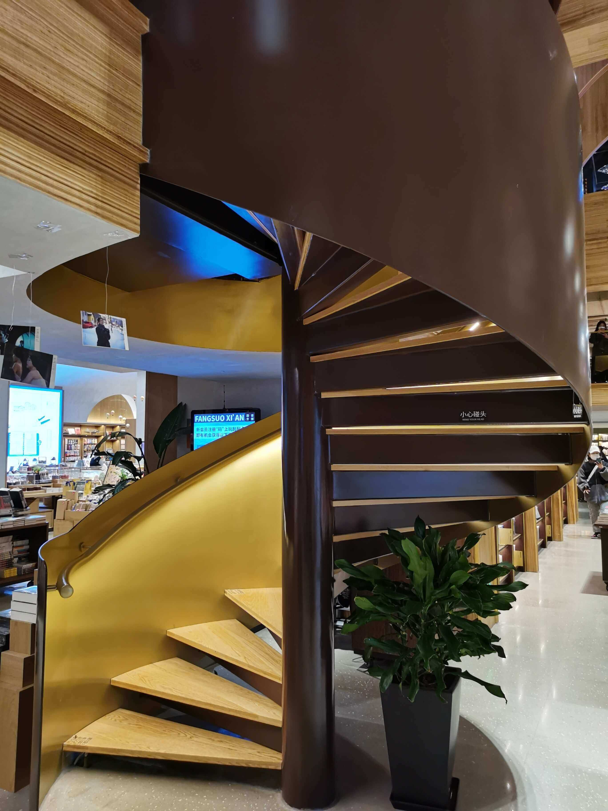

今天去的地方是西安方所，位于老城根，之前去的时候（19年去的）那边还没有那么多好玩儿的和好吃的，现在已经遍地开花，不过相对其他景点或说是网红打卡地来说，位置有点偏，所以两次去，两次感觉人都不咋多。

早就听说成都那边有个方所，特别特别大，藏书量也非常丰富，所以西安方所开业的时候，我没有去:clown_face:。

方所在老城根的尽头，就是进去一直走一直走，走到头就到了。网上说藏书有20W左右，嗯~，我就信了吧。

书的种类是挺多的，天文地理，百事百科都有，现在开放的区域有两层，第一层相对来说内容比较杂一些，除了展示图书的地方外，还有礼品区，理发店，玩具，家具等等，不过后面这些是跟书店分开的，所以总体感觉还好。

中间有个螺旋梯，可以上到二楼，三楼暂时还未开放。

二楼主要是相对比较专业一点的书籍，大都是设计类和美学的。哦，对了，还有漫画。在漫画的旁边还划出了一块区域是一家油画店，叫大鱼。有几幅画是真的棒，没有拍照，大家自己脑补 :grinning:。

再标志性的就是中间的书墙了，来，请看:

额，不大明显，来张网上的吧。

个人感觉，买书还行，毕竟书的类型挺全的，但是，不适合就地阅读，周围的环境比较嘈杂，消费区（图三）是开放式的。