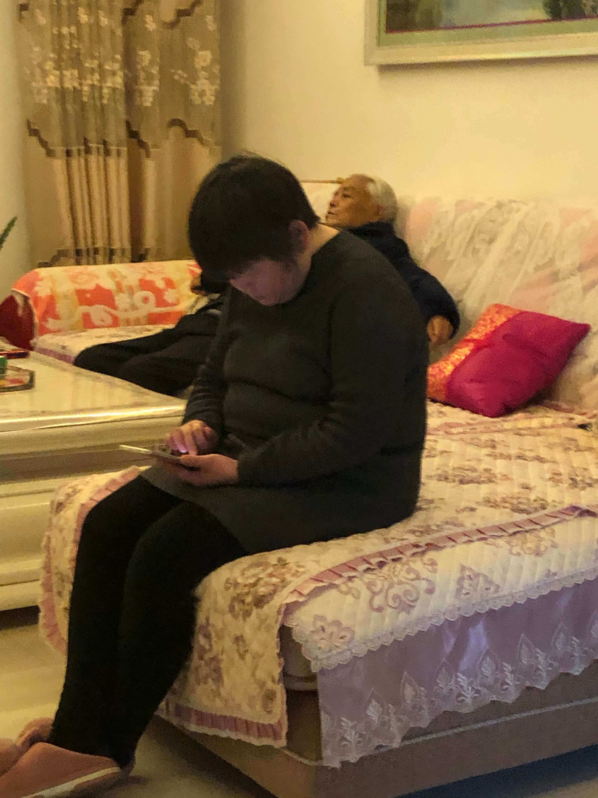
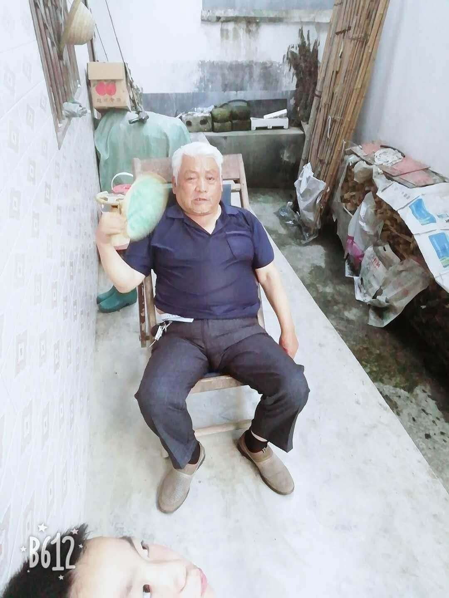
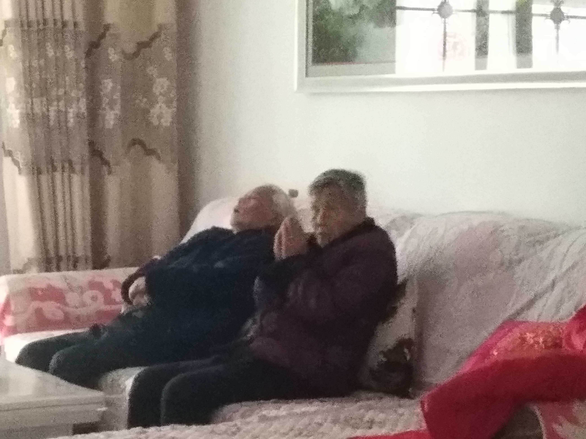
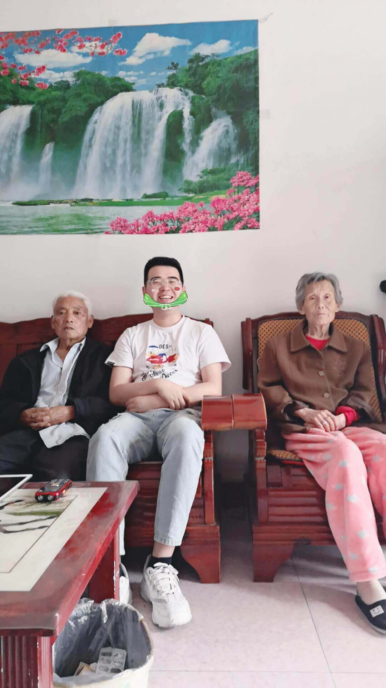

2020年10月17凌晨12分，爷爷去世了。

在网易云看到这样一段话：

```md
"那天爷爷掰着手指头和我讲，今年我79了，你一年回来两次，我要是还能再活五年，我还能见你十多次。"
```

现在是2021年5月14号，晚上，在电脑前止不住悲伤，想我爷。

我爷每周末都会打电话给我，说的话都差不多吧，他的想念很短，又很深：

```md
"何生鑫，吃了饭了吗？"
"西安最近天气咋样？"
"在外面照顾好自己，么钱了给我说，话费还有吧？"
"我跟你婆都好着哩，你放心，都好都好"
"怕你上班忙，都么敢给你打电话"
"啥时候放假？放假回来吧？回来几天？"
"好好，家里都好，你别挂牵"
"再见！再见！"
```

现在打电话的人不在了，我的脑子里还经常回响着他的思念。

我很害怕时间久了，就会忘记爷爷长什么样子，手机里存了几张爷爷的照片，每次翻看，都会重复一次爷爷离开的事实。



这是2020年，年初，疫情肆虐，我们回不去老家，只能待在县城，姑姑也经常来看爷爷和奶奶，奶奶站在阳台望着窗外，突然转过头给我说："鑫鑫，外面有5只公鸡，四个母鸡。"

爷爷坐在阳台晒太阳。

爷爷奶奶想家了，想回老家，在院里晒太阳，躺在椅子上优哉游哉的度过安逸的下午。


这是妹妹发给我的，应该是暑假拍的吧，那会儿的爷爷身体健康，胖胖的，穿个短袖，扇着扇子，旁边是弟弟，一切都很美好。



这张还是在2020年年初拍的，我给爷爷放了时事新闻，他不能长时间看电视，所以我就给他听新闻，奶奶在旁边祈祷疫情赶紧过去。



去年端午回家，爷爷已经很瘦了，吃不了东西，奶奶的腿也受伤了，心里很难过。



前年的时候，爷爷被查出来胃穿孔，医院说年纪大了，做不了手术，只能药物治疗，在汉中住了八天院，不能吃东西，只能打点滴，葡萄糖，8天瘦了20斤，肉眼可见的消瘦。