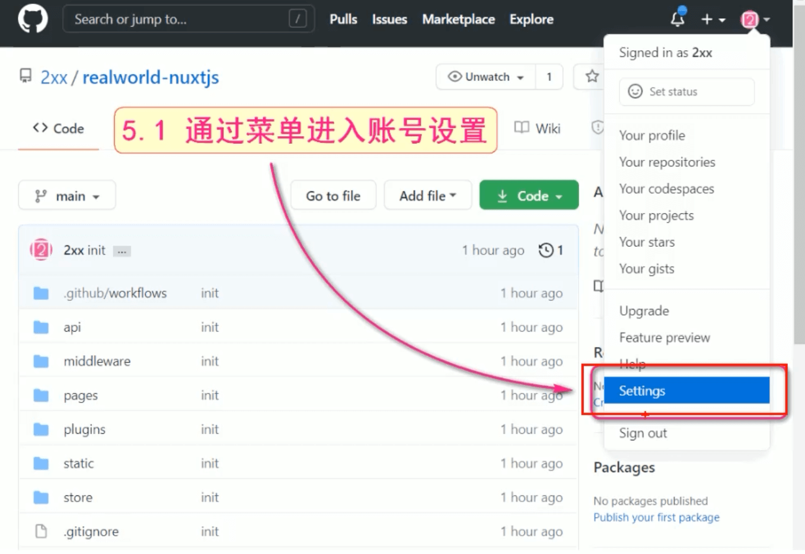
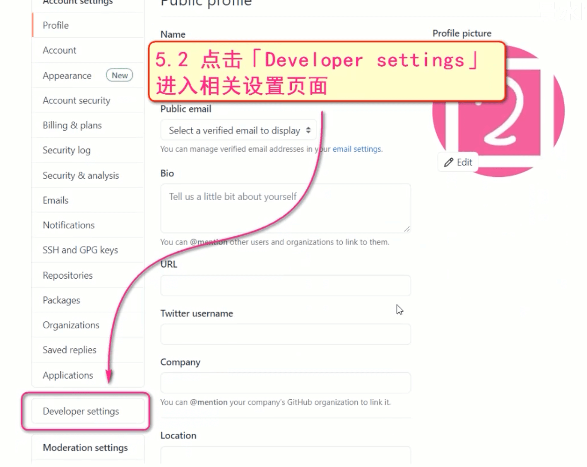
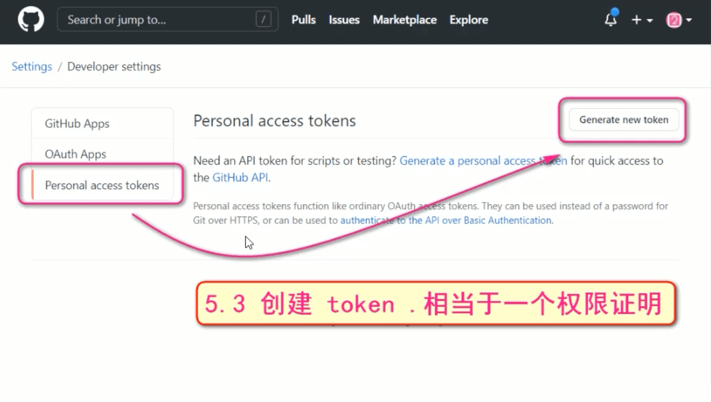
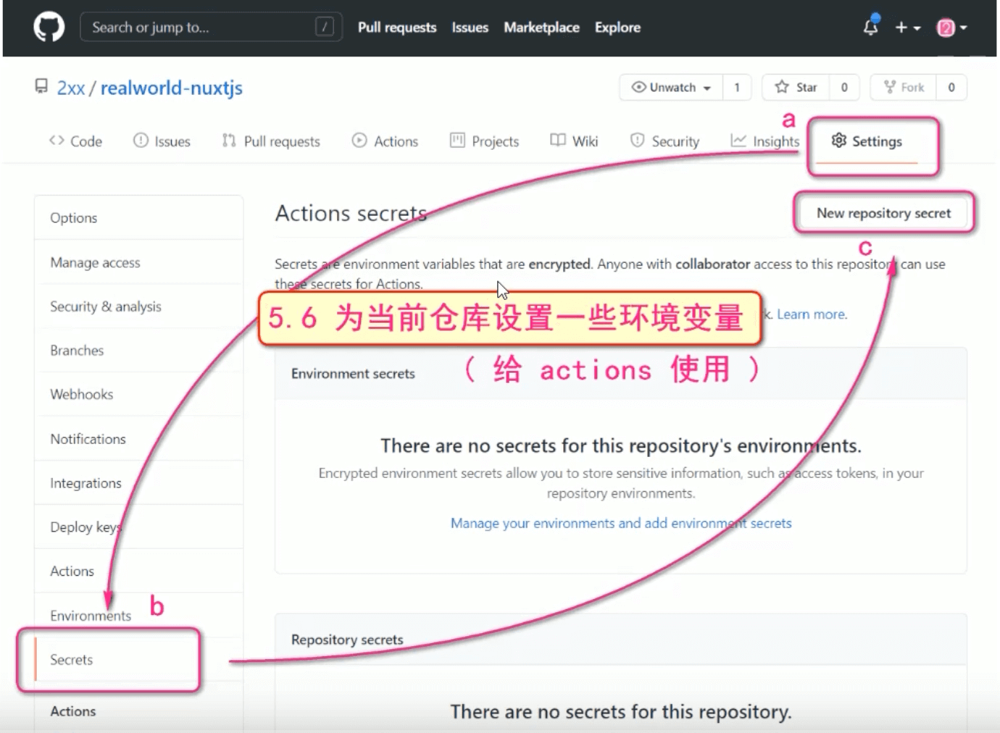
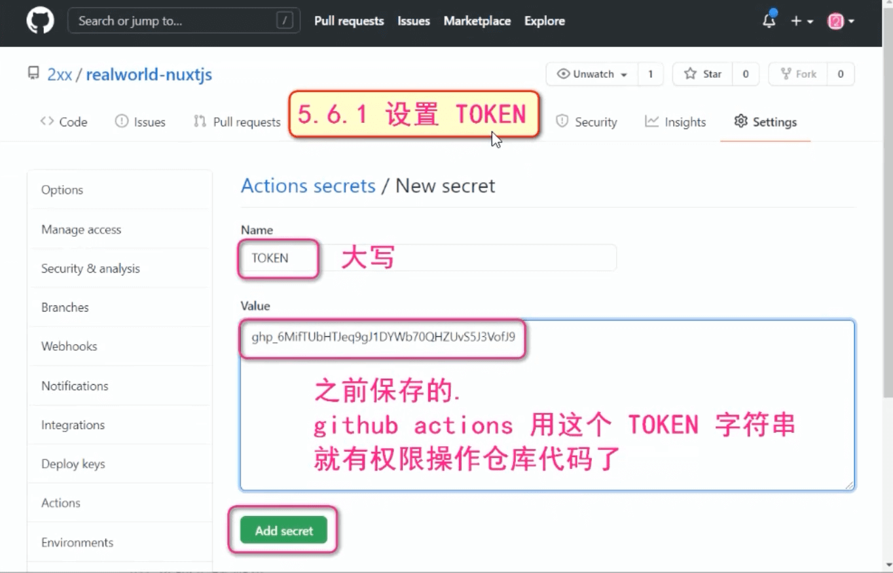
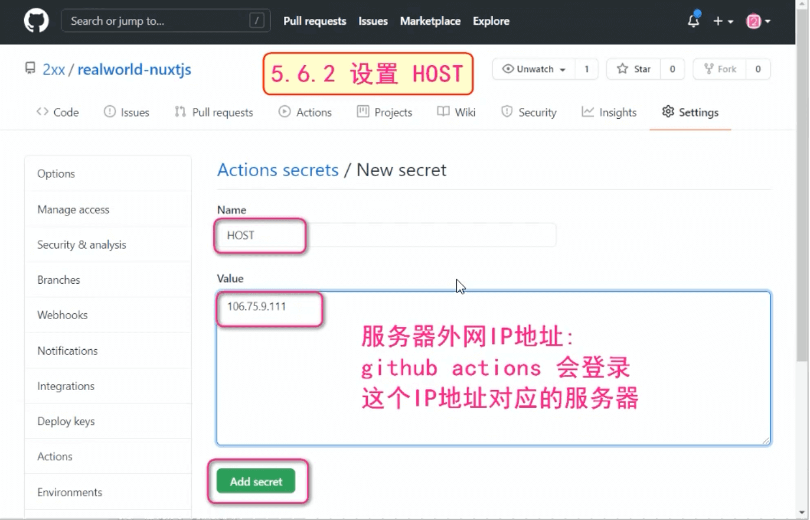
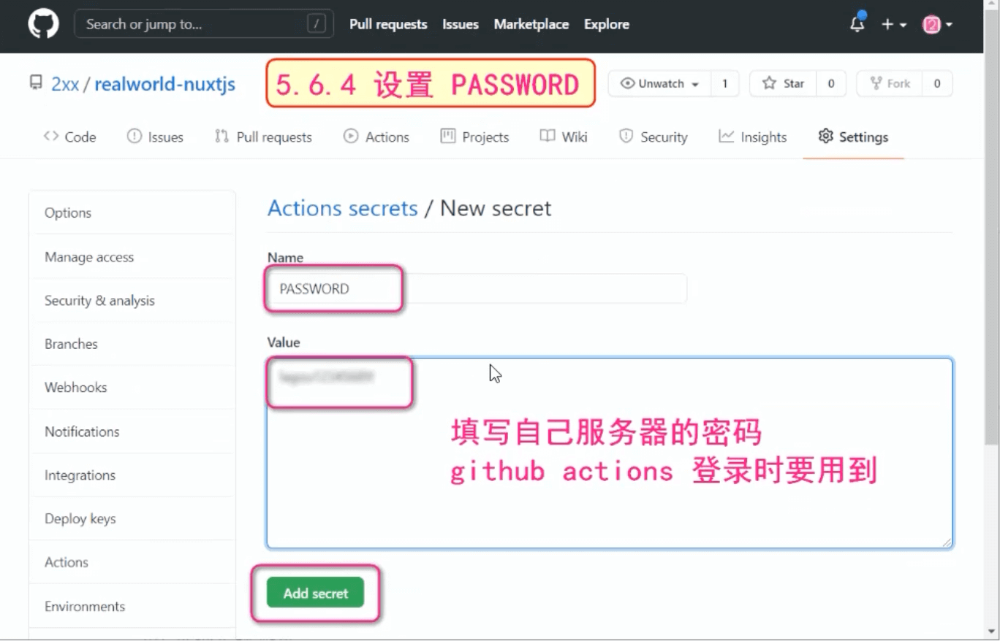
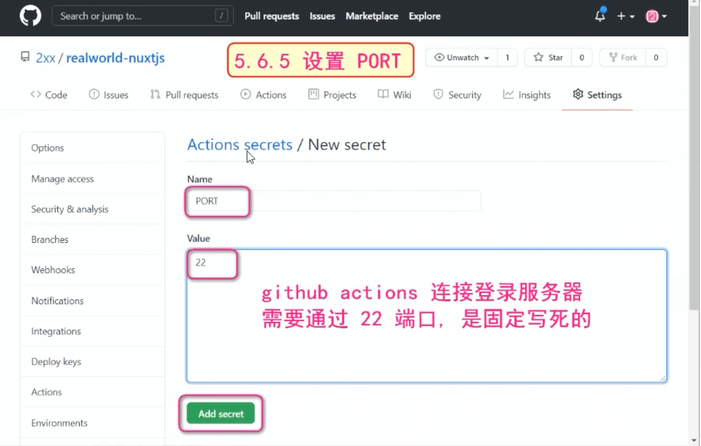
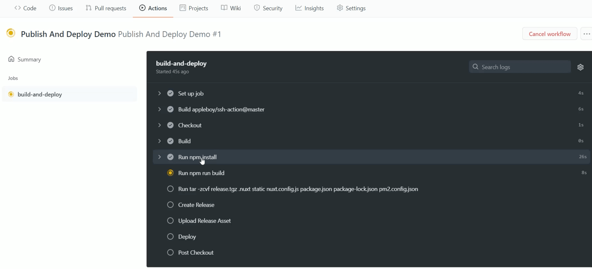

学习这个的主要原因还是想解放双手，实现代码提交至 Github 之后自动部署到服务器上的需求。
我们来一起看下是如何进行操作的。
那么 `Github Actions` 主要的工作就是什么呢？它的主要工作就是将我们上传到 github 的代码，下载安装依赖，并进行打包构建，最后将构建产物发布到我们的服务器上去，让代码在服务器上运行。
那首先第一点，对于我们的主干分支 master，需要将其强行切换到 main 上，为啥呢？因为现在 main 才是 github 上正儿八经的主分支，如果不这样做，可能会在 gitAction 的时候有坑。

```shell
git branch -M main
```

当我们的代码上传到 github 上去之后，我们就需要去配置 `Github Actions` 的信息了。
首先通过进入到个人中心的设置里面：


然后选择「开发者设置」：


接下来就是创建一个 `access token` （让 github actions 有权利操作仓库代码）：


这个生成 token 的操作，我已经有记录过了，可以看语雀那边的笔记。完成上述操作之后，就可以返回到仓库里去了。
接下来就需要给当前仓库设置一些环境变量了。

> Settings -> Secrets -> New repository secret



##### 1. 生成 TOKEN



##### 2. 生成 HOST



##### 3. 生成 USERNAME


##### 4. 生成 PASSWORD



##### 5. 生成 PORT



完成上述配置之后，我们还需要再去配置一下 `workflows` 的脚本，它的主要作用就是在 `Github Actions` 里帮我们安装依赖并打包构建项目。

###### 6. 配置 workflows 脚本

打开项目根目录下的 `.github/workflows/main.yml` 文件

原始的脚本长这样：

```yml
ame: Static Blog
on:
  push:
    tags:
      - "v*"

jobs:
  build-and-deploy:
    runs-on: ubuntu-latest
    steps:
      # 下载源码
      - name: Checkout
        uses: actions/checkout@master

      # 打包构建
      - name: Build
        uses: actions/setup-node@master
      - run: npm install
      - run: npm run build
      - run: tar -zcvf release.tgz .vitepress/dist

      # 发布 Release
      - name: Create Release
        id: create_release
        uses: actions/create-release@master
        env:
          GITHUB_TOKEN: ${{ secrets.TOKEN }}
        with:
          tag_name: ${{ github.ref }}
          release_name: Release ${{ github.ref }}
          draft: false
          prerelease: false

      # 上传构建结果到 Release
      - name: Upload Release Asset
        id: upload-release-asset
        uses: actions/upload-release-asset@master
        env:
          GITHUB_TOKEN: ${{ secrets.TOKEN }}
        with:
          upload_url: ${{ steps.create_release.outputs.upload_url }}
          asset_path: ./release.tgz
          asset_name: release.tgz
          asset_content_type: application/x-tgz

      # 部署到服务器
      - name: Deploy
        uses: appleboy/ssh-action@master
        with:
          host: ${{ secrets.HOST }}
          username: ${{ secrets.USERNAME }}
          password: ${{ secrets.PASSWORD }}
          port: ${{ secrets.PORT }}
          script: |
            cd /{service file}/{project file}
            wget https://github.com/{githubName}/{libName}/releases/latest/download/release.tgz -O release.tgz
            tar zxvf release.tgz
```

我们来解释一下里面的意思：

1. `name` 这个很好理解，就是命名，这个我们可以根据项目来写
2. `on` 就是事件的驱动，这里的意思就是说，当我们去 `push` 打了以 `V` 开头的 `tag` 的代码时，就会触发我们下面的任务 `jobs`
3. `runs-on` 我们的任务会运行在一个临时的 `ubuntu` 的系统上，它的作用就是替我们安装依赖，打包构建
4. `steps` 接下来我们将要执行的任务步骤，注释里都有写将要干什么
5. `uses` 表示执行到这一步的时候会运行的脚本
6. `- run: tar -zcvf release.tgz .vitepress/dist` 将打包好的 dist 文件压缩到 release.tgz 包里
7. `env GITHUB_TOKEN` 获取 github token 得到操作仓库的能力，以便将打包好的包放回到仓库里去
8. `script` 这里的步骤就是我们登陆到服务器之后要进入到项目存放目录，并将打包构建好的代码拉取下来，拉取下来之后解压缩即可（因为我们这里是静态博客，所以没有其他的操作了）

##### 7. 服务器设置

其实这一步就是查看一下我们要将项目存放到服务器的哪个目录下，一般的静态博客都是存放在 `/var/www/html` 下的，咱们在配置脚本的时候填写这个目录就可以了。

##### 8. 验证

我们在推送代码后怎么查看 actions 状态呢？
在仓库里，有个 `Actions` 标签，我们可以通过这个标签来进行查看。


在这里我们可以看到详细的安装打包过程，以及如果失败，失败后的日志信息等。
