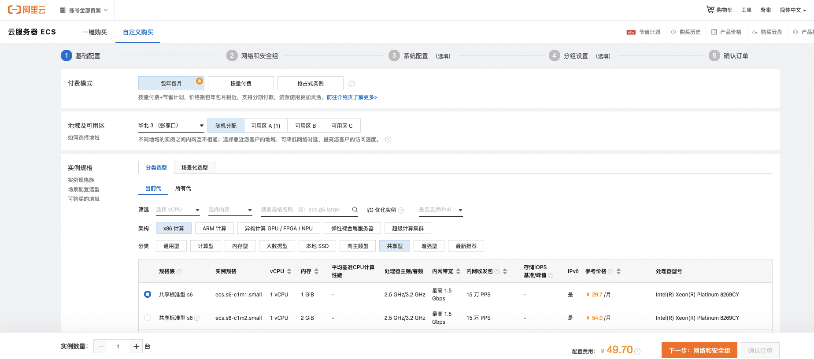
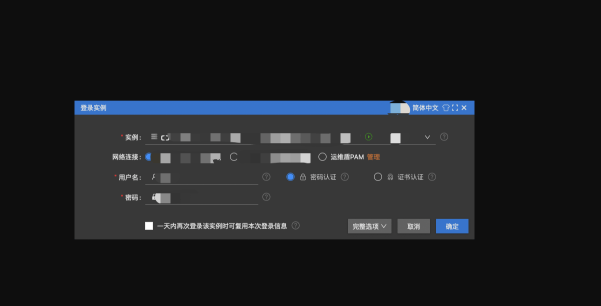
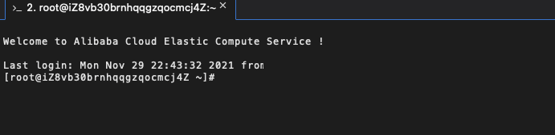

首先，我们使用的阿里云服务是 1 核 2G 的丐版配置（搞活动的时候买的，三年 145，很划算了，反正是练手用的）。然后系统是 Linux 的系统，接下来我们会在上面搭建一个个人的静态博客上去。

### 创建 ECS 实例

首先登陆我们的阿里云控制台，进入到云服务 ECS 页面，点击「创建实例」来创建一个 ECS 实例。



一步步往下走，最后付款即可。

### 远程连接

创建完实例之后，我们可以在左侧的菜单栏中选择「实例」，进入到实例列表页面，然后就可以看到我们刚刚创建的 ECS 实例了。我们点击列表操作栏的「远程连接」，登陆到该实例上。连接方式可以选择图中的任意一个，也可以使用 `ssh` 进行连接：


这里我们直接选择第一个，进入到 `workbench`：



这里其实只需要我们输入密码就可以了，第一次登陆的时候，密码是我们创建实例所设置的密码。成功之后就会显示欢迎的提示语：



此时我们就可以在这个实例上安装我们需要的东西了，比如我们要使用 `Nginx` 来做 `Web` 服务，那么就需要安装 `Nginx` 上去。下面是安装 `Nginx` 的步骤：

1. 在 `Linux `下安装 `Nginx`，需要先安装 `gcc-c++` 编译器
2. 然后安装 `Nginx` 依赖的 `pcre` 和 `zlib` 包
3. 最后安装 `Nginx`

```shell
# 先安装gcc-c++编译器
yum install gcc-c++
yum install -y openssl openssl-devel

# 安装pcre包
yum install -y pcre pcre-devel

# 安装zlib包
yum install -y zlib zlib-devel

# 创建nginx文件夹
mkdir /usr/local/nginx

# 下载或上传安装包
wget https://nginx.org/download/nginx-1.19.9.tar.gz

# 解压并进入nginx目录
tar -zxvf nginx-1.19.9.tar.gz
cd nginx-1.19.9

# 使用nginx默认配置
./configure

# 编译安装
make
make install

# 进入sbin，启动Nginx
./nginx

# 查看是否启动成功
ps -ef | grep nginx
```

### 补充一些 Nginx 命令

```shell
# Nginx重载配置
./nginx -s reload

# 测试配置文件是否正确::q

./nginx -t -c /usr/local/nginx/conf/nginx.conf

# Nginx快速停止服务
./nginx -s stop

# 查询主进程
ps -ef | grep nginx

# 重启 Nginx
./nginx -s reopen
```

做完上述操作之后，我们再创建一个放置静态文件的目录，在 /var/www/ 下创建一个 html 的目录：

```shell
mkdir /var/www/html
```

完成之后，我们通过 `sftp` 工具，远程登陆服务，将自己的静态站点上传到服务器上去。这里的 sftp 工具有很多，大家可以自行谷歌。基本都大同小异，输入主机 IP，也就是你的实例公网 IP，然后输入密码即可。
一般的面板都是左侧是本地的文件目录，右侧是服务器的文件目录，通过拖拽即可实现将本地文件上传至服务器中去。
上传完之后，我们再回到命令行中，修改一下 `Nginx` 的配置文件：

```shell
# 进入到 nginx 目录中的 conf 目录里，修改配置文件
vim nginx.conf
```

我们主要需要修改的地方是 `http` 下的 `server` 下的 `location` ：

```shell
location / {
	root /var/www/html;
	index index.html
}
```

修改完之后，保存退出（如果没有启用 `https` ，可以将 `https` 的部分注释掉）。
到这一步之后，我们最后重载一下 `nginx`：

```shell
nginx -s reload
```

大功告成，此时打开浏览器，输入你的实例公网 IP，就可以看到对应的静态站点了。
如果你有买域名并成功备案，还可以到云解析 DNS 页面进行域名解析，解析好之后，就可以通过域名来访问你的网站。

### 设置安全组

对了，还有一点，如果你的云服务器没有办法进行公网 IP 访问的话，一般是需要去检查一下你的安全组的，我们需要将 80 端口放开，才可以进行访问。
