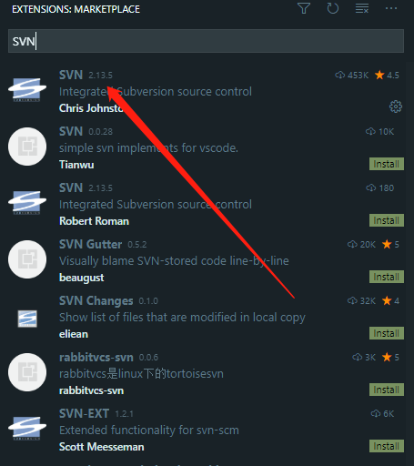
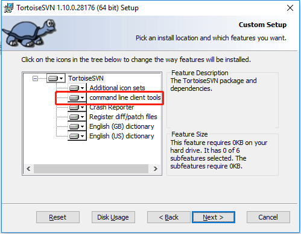
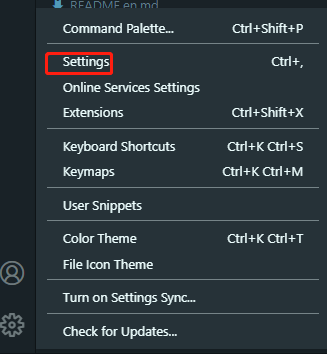
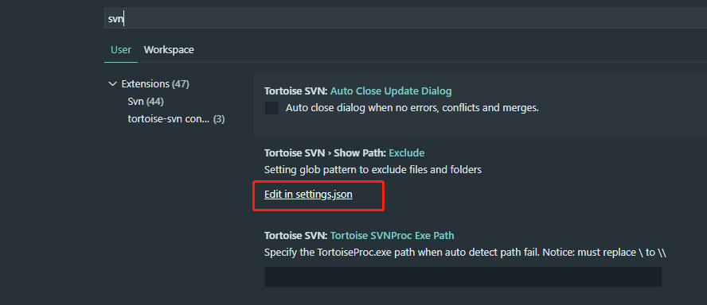
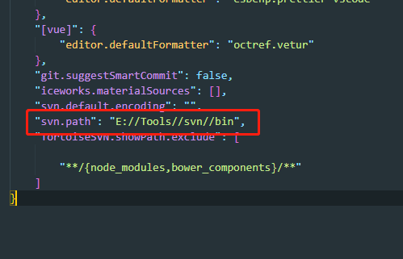
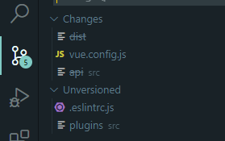

我们在使用 VSCode 进行编码时，如果遇到使用 SVN 来管理代码，可以在 VSCode 上直接安装一个 SVN 的插件来实现从编辑器上就能提交和拉取代码。

首先我们需要在 VSCode 中的应用商店去搜索 SVN，并点击下载：

安装完之后，我们需要本地安装 SVN 客户端，并且安装时需要注意将图示选项勾选上：

之后在你的 VSCode 设置中去配置对应的 svn 安装地址：

编辑对应的配置文件：

配置好 svn 安装的 bin 目录地址：

然后重启编辑器就可以正常使用了。可以在左侧的导航菜单上看到修改的文件并进行操作：
