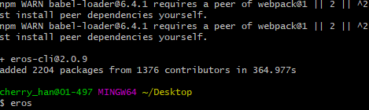
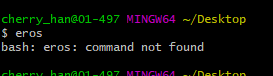

今天公司的一个小改改在下载安装了 eros 之后，在命令行使用不了，一直 command not found。

我们来分析一下：

首先，已经确认下载安装：
```shell
npm i eros-cli -g
```



但是在使用的时候：



那这种情况下可以归结到一类问题——没有配置环境变量。这块需要怎么配置呢？

我们将全局安装目录下的两个文件夹配置到环境变量中即可，将 `C:\Program Files\nodejs\node_global` 和 `C:\Program Files\nodejs\node_cache` 添加到环境变量Path中。

再次启动 cmd 就可以访问了。