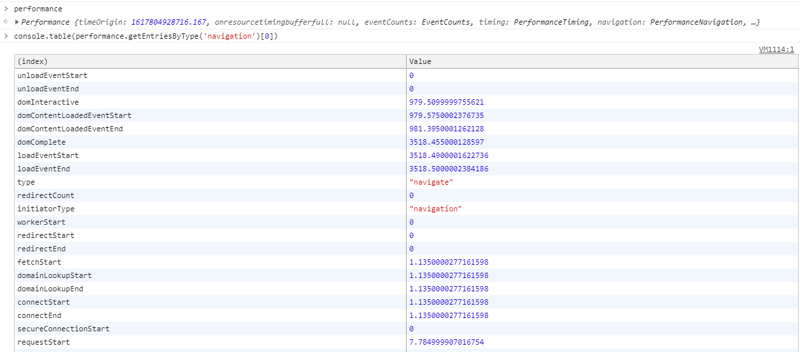
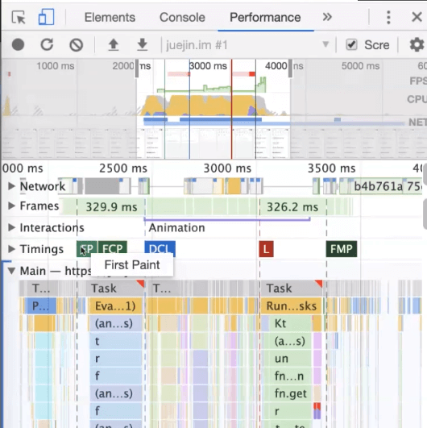

- 从输入 url 到页面展现发生了什么？
- 网络优化
- 浏览器优化

## 从输入 url 到页面展现发生了什么？

*万能面试题*

### 宏观

- DNS
  - 其实也是一个网络协议，把域名解析到 IP 地址。
  - 基于 IP 地址发 TCP 链接。
- TCP
  - 三次握手
  - 四次挥手
  - 慢启动
  - 滑动窗口
  - 超时重发
  - ...
- HTTP / SSL
  - 缓存相关
- 响应解析
- 浏览器渲染
  - how browser works 文章

这些内容每一块的时间加在一起就是从我们输入 url 到页面显示出来的时间。那从优化层面上讲，就是让这块内容更好更稳定的显示出来。

```md
url -> dns 获取 ip -> 建立 tcp -> 发起 http -> 解析响应 -> 浏览器渲染
```

我们大概说下概念，ip 是我们寻常说的寻址，那在它之上有 TCP（可靠协议）和 UDP（不可靠，发出去基本就不管了）。`那 UDP 的应用场景？`，而且我们说的 DNS 其实基于 UDP 来构建的。而 HTTP，FTP还有SSH都是基于 TCP 来做的。

::: tip

`<link rel="dns-prefetch" href="//g.alicdn.com" />`预先解析一下这个url。

:::

### 基于网络协议产生的性能优化方案

### HTTP 解析逻辑

http 基于 TCP，定制了解析的逻辑。

```
method 地址 http/版本
key: value
key: value

body
```

相对于前端而言，以上我们只做了解，我们更需要去关注静态资源的缓存（也是包含在工程化里的重点）。

### 前端是怎么上线代码的？

小应用：开发完毕，html，css，JavaScript 放到 nginx 就可以了。

有数据交互的，开发完毕之后，模板都在 server(smarty, jsp)，静态资源放置在 CDN 上。

::: tip CDN

如果把静态资源都放置在服务器上，那相对服务器位置较远的地方去访问，会因为距离导致的电缆长度加交换机之间的交换延迟，是没有办法去优化解决这个问题的。而将这些资源放置到 CDN 上去之后就可以很大程度的解决这个问题。

:::

在现在我们利用 webpack 自带的 contentHash 来更好的利用缓存。

### 浏览器缓存的逻辑

- 强缓存
- 协商缓存

### 线上静态资源更新方案

contentHash 和 版本号。

### 简单粗暴的优化策略

- 文件加载的更少
  - 缓存，CDN
  - 图片优化
  - 静态文件优化
  - 浏览器优化
  - 文件合并压缩等
- 代码执行的更少

控制异步并发数等等。

### 响应解析

响应报文返回。

在拿到 html 之后，怎么处理？

1. SPA——返回的是一个空的 html，所有逻辑都在 js 里。
2. 同构——首屏渲染加速 + SEO（nuxt, next）
   1. 需要 nodejs 环境，应用首屏，先在 node 里执行渲染一下，然后再返回浏览器。
   2. 后续就是单页的逻辑

最后是浏览器解析 html，然后到 css，再到 js 的执行。

从输入 URL 到页面渲染的时间怎么变短，每一步都有对应的参数指标。

### 浏览器渲染

1. 解析 html (AST) dom tree
2. 解析 css -- CSStree
3. 将以上两部分合并成 render tree
4. 浏览器调用操作系统渲染
5. 重绘回流

### 图片优化

- JPEG
- PNG
- GIF
- Webp
- 压缩工具，不同尺寸
- 渐进加载（先加载站位 =》低像素 =》实际）

### 代码执行更少

- 节流防抖
- 按需执行
- 回流重绘
- 框架优化（如 vue3 的静态标记）
- 基础——减少DOM、尽量避免通配符、正则选择器等

### 渲染模式

- 服务端直接渲染模板
- SPA
- 同构

## 前端性能监控

- 前端性能指标分析
- 关键性能指标统计
- 数据上报方式
- 性能分析工具

### 前端性能指标分析

- FP 首次绘制
- FCP 首次内容绘制
- FMP 首次有效绘制
- TTI 可交互时间

### 图片

1. 格式问题
   - jpg, png, webp
   - 在 node 里压缩图片等
   - 在 cdn 里最合适的方式，就是通过 url 来定制图片的格式、大小
   - jpg 的图片格式大小比 png 的小很多
   - 先加载模糊的图占位，然后再加载清晰的图片格式，有一个渐进展示的效果
2. 静态资源压缩——compression：webpack 里内置了 gzip 压缩，配合 NGINX 使用。
3. Tree Shaking

FP? FCP? FMP?

相对而言，前端首屏打开的速度是非常重要的。我们在 vue 中会使用 SSR 服务端渲染来提高首屏的渲染速度。

## 统计

|           | fetch                                           |
| --------- | ----------------------------------------------- |
| 重定向    | redirect                                        |
| DNS       | domainLookup                                    |
| TCP       | connection                                      |
| 发送请求  | Request                                         |
| 响应      | Response                                        |
| Dom parse | Domloading DomInteractive<br />domContentLoaded |
| render    | domComplete                                     |

为了解决 SPA 的首屏和 SEO 问题，必须要用的方式：

1. prerenderer--预加载
2. 静态化-京东做了大量的静态化，也就是很多的 html。
3. 同构（ssr + spa）综合体

我们在主流浏览器的控制台去访问 Performance API，调用 `getEntriesByType('navigation')[0]`，之后打印出来，可以看到各个时间点的细节（当前页面性能的一个数据）：



我们根据 W3C 标准给的图来查看对应的节点：


这样将两个图结合起来看就可以得到对应点的信息。

我们在页面中可以算出来的指标，都是硬性的。而和交互相关的，则需要别的方式来统计——FMP。

## FMP 计算

FMP(first meaningful paint)，可以理解为第一个有意义的页面。拿淘宝为例，当淘宝首页进去之后，看到的页面就可以理解为 FMP。


不同的业务模式都有自己 FMP 的定义，FMP 没有一个统一的概念，**视业务而定**。也可以这样理解，只要是有意义的渲染，我们都可以视为 FMP。拿百度来说，只要渲染出搜索框和logo就可以认为是 FMP。

那么如何设计 FMP 的算法？

前置知识：对浏览器的工作机制有所了解。

> 在 Chrome 的 performance 中，有对 FMP 的判定
>
> 

1. 页面进入的时候，使用 mutationObserver API 对 DOM 进行监听
2. 对变化的 DOM 打上标记
3. 文档的 load 触发
4. 遍历 DOM Tree
5. 根据元素的可视区域，计算元素的权重
6. 遍历父元素，对比合并
7. 找到权重最高的
8. 判断此元素是否加载完毕
   1. 还需要判断是不是 img、video、audio这种资源标签，如果是，还需要判断资源的加载时间 performance.getEntries
   2. 只是单纯的 DOM，只要用时间 - dom 变化即可。
9. 最后算出 FMP。

## 我们能做哪些优化？

### 前端框架性能

- FMP 统计接收
- Vue 里的性能优化
- React 里的性能优化
- 其他框架

只要能快一点，都算优化

1. 代码优化
   1. 框架本身的优化
   2. js 和 css 的写法
2. 研发优化 项目的深度优化
   1. 需求（项目不知道怎么描述）
   2. 大文件上传
   3. 长列表优化
3. 开发环境的优化(vite, snowpack)
4. 人的优化

## FMP 统计

先在 git 上 down 下来一个 [demo](https://github.com/bailicangdu/vue2-elm)。

### FMP

- 真正页面被用户看到的指标
- 相对于FP，FCP，更贴近实际
- 没有统一标准，计算方式
  - 自己的产品给个元素打点
  - MutationObserver
  - 趋势计算 dom 变化趋势

### FMP 计算演示

- 计算
  - 元素权重：宽\*高\*权重（img, video要比普通DOM高）
  - 进入页面开始记录，启用 mutationobserver
  - 遍历 dom tree，根据可视区域面积，计算得分
  - 遍历父元素修正得分（父元素与子元素之和的最大值）
  - 平均值，过滤出目标元素
  - 是否是 img、video 和 canvas 等
  - 合计求出 FMP

大佬建议：如何遇到瓶颈，可以去面试求虐！！！