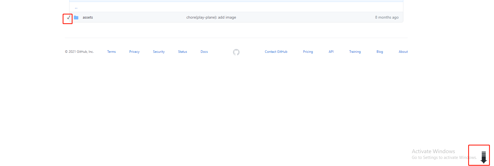
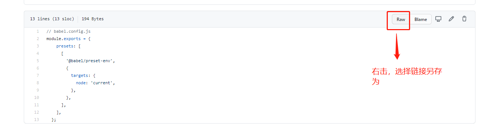
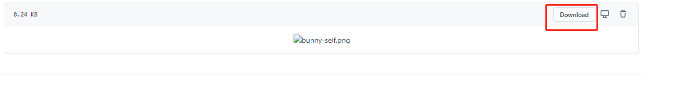
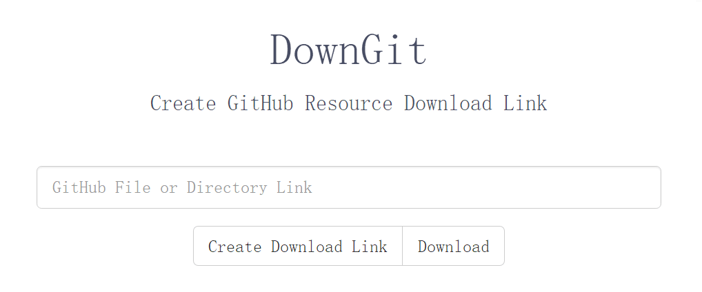

我们经常会在开发过程中上全球最大的同性交友网站查（chao）找（xi）一些优秀的开源项目，来填充自己空虚的内心，经常会用到的命令就是 git clone，使用 clone 来下载整个项目到本地。但是平常还有一种需求就是——你可能只需要其中的一个文件夹或者文件，那么这个时候我们怎么去进行下载呢？github 可没有提供单个文件或文件夹下载的API。

不要慌，不要急，下面给大家介绍两种方法来解决问题：

## 一劳永逸——安装 `GitZip for github` 插件
   
不得不安利一下这款插件的方便，在谷歌应用商城下载安装后，打开需要进行下载任务的页面，在下载项的空白处双击，你会看到右下角出现一个下载的图标，而下载项的左边出现一个对勾，这个时候点击下载的图标，即可对当前选中项进行下载。当然了，不止可以下载一个，还可以下载多个，操作方法一样。

这样就可以满足我们在平时想单独下载一个多几个文件的需求了。

::: tip
有的小伙伴可能会说了，插件好是好，但是谷歌应用商城是需要爬梯子的，没有梯子怎么办？不要慌，这里还为大家准备了国内的一个网站，里面有很多 Chrome 插件，妈妈再也不用担心你安装不了插件了。网站传送门在这里👉[扩展迷](https://www.extfans.com/)
:::

## 在 github 中右击 Row
如图：

我们打开一个文件，需要注意的是文本文件类的，会有 raw 按钮，然后右击选择链接另存为即可下载。如果是图片类的，可以直接点击 download 进行下载：

局限性也很明显，每次只能下载一个文件。

## DownGit

DownGit 也可以实现上述需求，而且不用安装任何东西，只需要打开网页即可。BUT！！！国内的小伙伴们，这个网站在请求的时候随缘！你们懂得，附上链接[DownGit](https://minhaskamal.github.io/DownGit/#/home)

