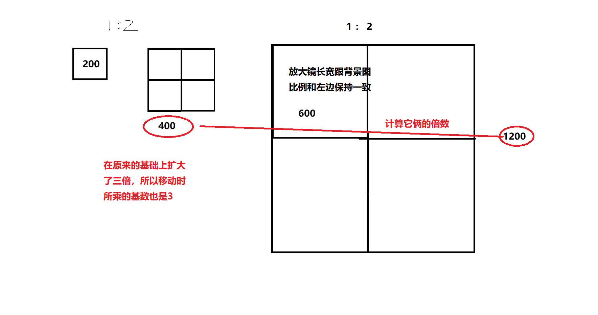

今天跟小伙伴讲 JavaScript 实现放大镜时翻了车，特此记录，以资鼓励！

放大镜效果是我们在前端里经常会遇到的，这里大概分析一下怎么实现一个放大镜效果，以及里面的原理。

首先，我们需要准备三个 DIV 元素和对应的 css：

```html
<!-- css -->
<style>
        *{
            padding: 0;
            margin: 0;
        }
        div.preview_img{
            width: 400px;
            height: 400px;
            margin: 50px auto 0;
            position: relative;
            background-color: lightseagreen;
        }
        div.preview_img div.mask{
            height: 200px;
            width: 200px;
            top: 0;
            left: 0;
            position: absolute;
            z-index: 999;
            background-color: rgb(235, 235, 121);
            opacity: 0.5;
            border: 1px solid black;
            display: none;
            cursor: move;
        }
        div.preview_img img{
            width: inherit;
            height: inherit;
        }
        div.big{
            width: 500px;
            height: 500px;
            position: absolute;
            left: 410px;
            top: 0;
            display: none;
            z-index: 999;
            border: 1px solid #ccc;
            overflow: hidden;
            background-image: url('./images/img3.jpg');
            /* 2-3 */
            background-size: 1500px 1500px;
        }
</style>
<body>
    <div class="preview_img">
        
        <div class="mask"></div>
        <div class="big"></div>
    </div>
    <script type="text/javascript">
        // 后面写
    </script>
</body>
```

从结构上来说，我们需要一个展示原图的 div，并起名 preview_img，然后在里面包裹了三个子元素：

- img 图片
- 在原图中滑动的小方块
- 放大镜的容器

然后设置放大镜的容器背景图为图片本身。

这是关于 HTML 结构的代码，接下来我们来分析一下，如何去实现放大镜这样一个效果：

1. 首先，放大镜无非就是把原图放大多少倍而已，所以，这里就牵扯到了一个比例的关系；

2. 第二步，分析比例关系：

   - 假设原图尺寸400，放大镜400，现在要做到2倍镜，那么背景图我们就需要放800的尺寸；
   - 对于原图上的小方块尺寸200，放大镜尺寸是400，那么移动的倍数也是需要做到2倍；
     - 而假设原图尺寸是400，放大镜时600，现在同样做2倍镜，那么背景图我们按放大镜的尺寸乘以2，就是1200；
   - 对于原图上的小方块尺寸没有变，还是200，放大镜尺寸是600，那么此时移动的倍数应该是两数之比，即要做到3倍；也就是说移动时，所乘以的倍数是根据原图和背景图的一个扩大程度来计算的，这里就是**原图（移动方块）和放大镜（移动方块）图片的比例**，如下图：

   

   - 由上图我们可以知道，左边的大小正方形比例是1:2，那右边部分，我们可以把放大镜容器看成是左边移动的盒子，而背景图可以看成是原图，要做到丝滑的衔接效果，我们要保持左右两边的比例是一致的，这里就是**移动的方块和图片的比例**。

3. 第三步，分析操作步骤：

   - 首先，小方块和放大镜都是隐藏的
   - 鼠标划入原图后，上面两个 DIV 显示，划出继续隐藏；
   - 鼠标移动的时候需要做边界判断；
   - 滑动的时候小方块是跟随鼠标的，所以这里还需要给小方块动态设置坐标位置；
   - 在鼠标移动的时候，计算移动的距离，并乘以第二步里所说的移动倍数，动态修改背景图的位置；

4. 开始写代码

```js
window.addEventListener('load', function () {
  // 获取要用的 DOM 元素
  var preview_img = document.querySelector('.preview_img');
  var mask = document.querySelector('.mask');
  var big = document.querySelector('.big');
  // 对应3-2
  preview_img.addEventListener('mouseover', function () {
      mask.style.display = 'block';
      big.style.display = 'block';
  })
  preview_img.addEventListener('mouseout', function () {
      mask.style.display = 'none';
      big.style.display = 'none';
  })
  // 3
  preview_img.addEventListener('mousemove', function (e) {
      var x = e.pageX - this.offsetLeft;
      var y = e.pageY - this.offsetTop;

      var maskX = x - mask.offsetWidth / 2;
      var maskY = y - mask.offsetHeight / 2;
      
      // 3-3
      if (maskX <= 0) {
          maskX = 0;
      } else if (maskX >= preview_img.offsetWidth - mask.offsetWidth) {
          maskX = preview_img.offsetWidth - mask.offsetWidth;
      }
      if (maskY <= 0) {
          maskY = 0;
      } else if (maskY >= preview_img.offsetHeight - mask.offsetHeight) {
          maskY = preview_img.offsetHeight - mask.offsetHeight;
      }
      
      // 3-4
      mask.style.left = maskX + 'px';
      mask.style.top = maskY + 'px';

      //大图 3-5
      // 这里的乘以2 就是 2-4 里计算的比例
      big.style.backgroundPositionX = -maskX * 2 + 'px';
      big.style.backgroundPositionY = -maskY * 2 + 'px';
  })
})
```

