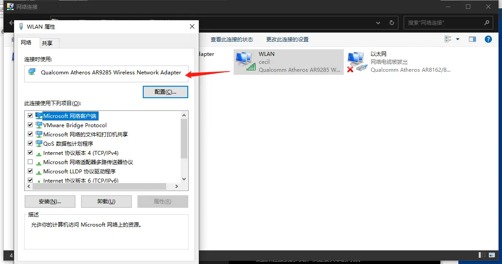
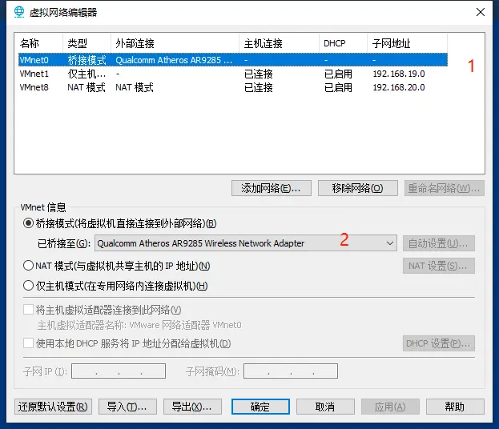
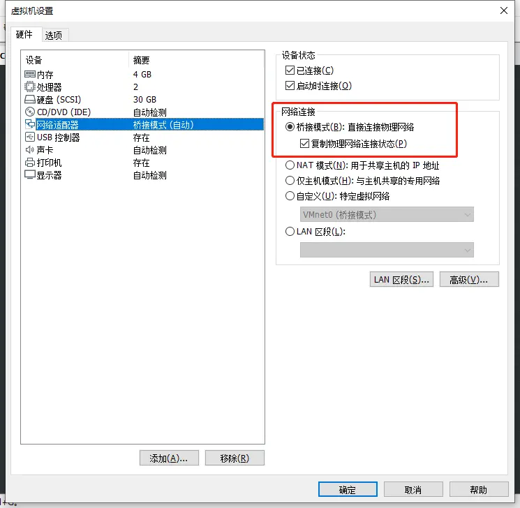
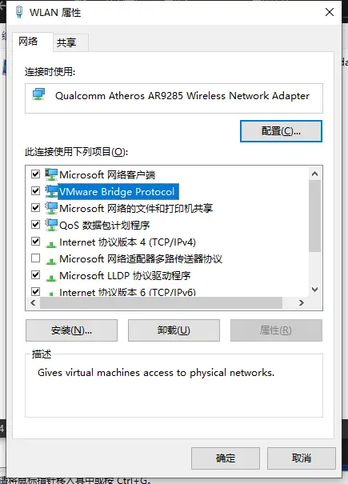

我这两天在学习 K8S 的相关知识，然后在之前的 Win10 电脑上装了一台 CentOS 的虚机方便练习，但是在练习的过程中，两台电脑之间相互切换着来敲非常不好，很不方便。所以我就想既然在一个网段下，那么能不能直接从现在的电脑上去访问那台虚机呢？

既然有需求，那么我们就开始着手研究。

其实要实现上述需求的方法很简单，那就是**组件一个局域网**。

### 设置虚拟机网络

**将虚拟机中的电脑设为桥接模式**

1. 打开电脑的网络适配器，查看当前 WLAN 的网卡名称

   

2. 点击虚拟机软件菜单编辑-虚拟网络编辑器-选择 VMnet0-桥接模式-桥接到「选择上一步的网卡名称」

   

3. 启动 CentOS 后，设置其网络适配器为桥接模式

   右击左侧计算机列表中的 CentOS，选择设置

   

4. 在 VMware 中：`vmnet0` 对应桥接模式；`vmnet1` 对应 NAT 模式；`vmnet8` 对应仅主机模式；

5. 如果修改完桥接模式后，上不了网：

   1. 查看本机网络适配器中的属性里是否有 `VMware Bridge Protocol` 选项。如果没有，需要通过安装-服务-添加-从磁盘安装-浏览-选择 VMware 安装目录下的 `netbridge.inf` -确定来安装。安装后就会出现。

   2. 安装好以后需要选中该选项

      

   3. 确保「桥接到」选项卡中出现的主机电脑的网络适配器是正确的，即和我们第一步中看到的是一样的

6. 修改 CentOS 网络配置：`vim /etc/sysconfig/network-scripts/ifcfg-eno33`

   ```shell
   TYPE="Ethernet"
   PROXY_METHOD="none"
   BROWSER_ONLY="no"
   BOOTPROTO="static"   #static，静态ip，而不是dhcp，自动获取ip地址
   DEFROUTE="yes"
   IPV4_FAILURE_FATAL="no"
   IPV6INIT="yes"
   IPV6_AUTOCONF="yes"
   IPV6_DEFROUTE="yes"
   IPV6_FAILURE_FATAL="no"
   IPV6_ADDR_GEN_MODE="stable-privacy"
   NAME="ens33"
   UUID="1227d2aa-2f69-419e-85de-b38324602083"
   DEVICE="ens33"
   ONBOOT="yes"
   ZONE=public
   GATEWAY=192.168.1.1    #网关和物理主机一样
   NETMASK=255.255.255.0  #子网掩码即（255.255.255.0），和物理主机一样就可以了
   IPADDR=192.168.1.125   #设置我想用的静态ip地址，要和物理主机在同一网段，但又不能相同
   ```

   修改完成以后按 ESC 进行命令模式，然后 `shift` 键 + 冒号，输入 wq 保存退出

7. 重启服务：`service network restart` 

完成上述步骤以后，我们在 CentOS 里打开浏览器，测试一下是否可以正常访问网站，如果不行，那么按照第五步里的描述，再仔细检查自己的配置。

### 开始连接 CentOS

打开另一台电脑的终端命令行工具，比如 XShell 之类，使用 `ssh` 进行访问即可：

```shell
$ ssh [username]@[ip]
```

 