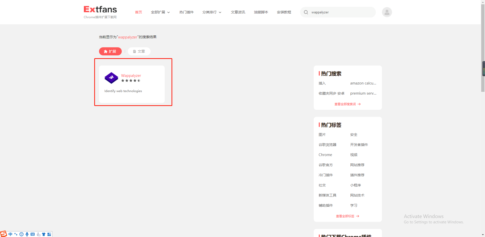
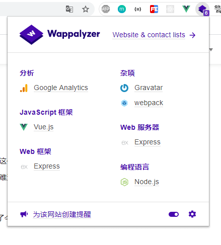

前些天我们公司一位小改改问我，要怎么看页面里用的是哪些技术？我第一个反应是 vuetools 满足不了你这个需求吗？满足不了的话还有 react 和 angular，进到应用商店将这些插件都安装一下不就行了吗？但是她一个反问就镇住我了：难道没有一个可以分析页面都用了哪些技术栈的插件吗？一个一个去下载，很麻烦，而且很不友好。

一语惊醒梦中人，对呀！有没有一个插件去做将页面里用的技术栈都分析出来呢？带着这个疑问，引出来了今天要介绍的浏览器插件——Wappalyzer！

## Wappalyzer
Wappalyzer插件，是一款开发必备的网站技术嗅探工具，能够用来检测和分析当前网站的各种参数，比如平台架构、编程语言、网站环境、服务器配置、javascript框架等。

Wappalyzer插件是一款功能强大、简单易操作的网站技术分析检测工具，能帮你对所访问网站上使用的技术一目了然。

通过它，能够一键分析指定网站所采用的平台构架、统计工具、服务器配置、Web框架、编程语言等参数。

### 安装
同样，国内的小伙伴还是上[扩展迷](https://www.extfans.com/)，然后搜索 Wappalyzer：

点击 Wappalyzer 进入到详情页面，直接点击下载，然后将下载的压缩包解压，将其中的 Wappalyzer.crx 拖到 Chrome 浏览器的扩展程序上即可。

此时打开你需要分析的网站，单击插件图标，然后这个新面板中就会弹出网站的分析结果报告了。

