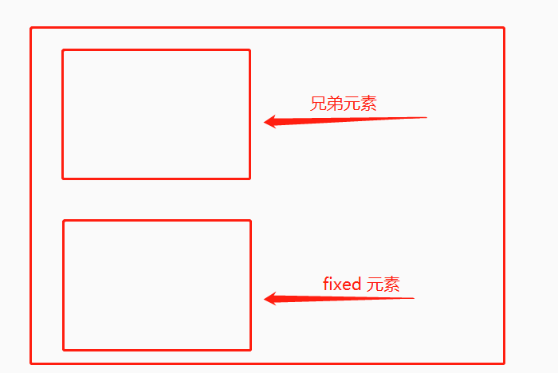

今天碰到一个有意思的问题，当我设置了 `position: fixed` 之后，发现只是起了一半的作用。具体是怎么样的呢？来看下示意图：

现在在一个div里有两个元素，其中一个子元素为 fixed，而另一个元素是常规的块级元素。照常理，fixed 元素，也就是我们说的被固定定位过的元素，应该会到左上的位置，但是现在展示的效果缺失 fixed 元素跑到了可视区域外部。

这是因为没有提前预设 top 值导致的，当父元素里有且只有一个元素的时候，fixed 的位置默认是左上，而当有两个以上的元素时，如果在 fixed 元素之前还有一个兄弟元素，那此时 fixed 元素的位置默认是靠左，然后垂直方向上在这个兄弟元素下方。

以上情况都是在没有预设位置属性的场景，也就是只设置了 `position: fixed`，并没有设置 `top left right bottom`。

现在还有一种情况，比如只设置了其中一项位置属性：
1. **top**：只设置 top 时，会显示在左上方，top的距离是设置的值；而若是在它之前有一个兄弟元素时，默认是靠左，然后Z轴方向上在这个元素上方。
   
   
   
2. **left**：只设置 left 时，top 值自适应，有且只有一个元素时会显示左上；而若是在它之前有一个兄弟元素时，默认是靠左，然后垂直方向上在这个兄弟元素下方。
   
   
   
3. **right**：只设置 right 时，top 值自适应，有且只有一个元素时会显示右上；而若是在它之前有一个兄弟元素时，默认是靠右，然后垂直方向上在这个兄弟元素下方。
   
   
   
4. **bottom**: 只设置 bottom 时，元素位置在设置的位置属性值上；若是在它之前有一个兄弟元素时,元素该在啥位置还在啥位置。
   
   

如果发现有 fixed 元素不在预期的位置上，那就有可能是css里的位置属性没有设置好。