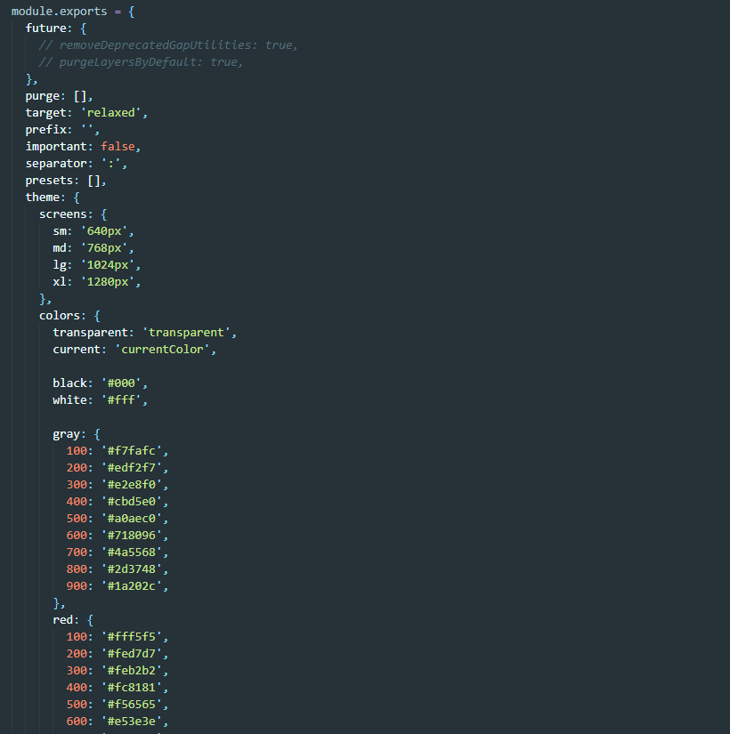
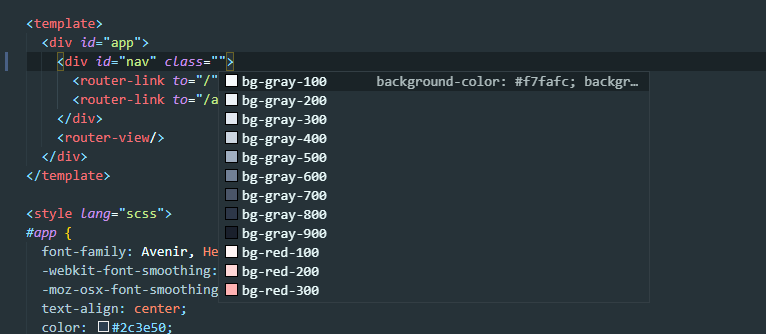

先给[官网地址](https://www.tailwindcss.cn/)给您们。

::: tip 官网描述
Tailwind CSS 是一个功能类优先的 CSS 框架，它集成了诸如 flex, pt-4, text-center 和 rotate-90 这样的的类，它们能直接在脚本标记语言中组合起来，构建出任何设计。
:::

它有以下几大优点：
1. 设计系统的API。tailwindcss 已经帮我们设置好了一系列的元素样式，它们可以轻松地在颜色选择、间距、排版、阴影以及其他一切构成一个精心设计的系统的元素上保持一致；
2. 生产环境下的体积非常小，只有8.7KB；
3. 响应式；
4. 直接在 HTML 上使用 hover 等状态；
5. 灵活的复用性；
6. 支持深色模式，让网站切换白天黑夜；
7. 基于 `tailwind.config.js` 定制属于自己的设计系统；
8. CSS 前沿特性支持；
9. IDE 集成插件；
10. 基于 tailwindcss 而写的 tailwindUI 也是一款开箱即用的UI库

当然，它最大的作用还是提高我们的**开发效率**！

最新的 TailWindCSS 版本是 `v2.0.2`，虽然说在各方面都得到了优化和提升，并支持更多的样式和功能。但是不支持 IE，所以在目前实际项目阶段，不推荐使用（毕竟 IE 还有一定的用户），我们如果在项目中要使用，最好还是使用 `v1.9.6` 版本的。

接下来演示一下如何在项目中快速引入 `tailwindcss`：

1. 下载安装
```js
npm install tailwindcss@1.9.6 -S
```

2. 在项目中新增一个 `tailwind.css`，然后使用 `@tailwind` 指令将 `tailwindcss` 中的 `base、components、utilities` 模块引进来：
```css
@tailwind base;

@tailwind components;

@tailwind utilities;
```

3. 创建好之后呢，这里我们还需要使用命令再生成一个 `tailwind.config.js` 配置文件，可以使用命令生成一个默认的：

```js
npx tailwindcss init -full
```

这个命令会帮助我们生成一个默认的配置文件，而不是一个空文件：



4. 接下来呢，我们再结合 `PostCSS` 来使用 `tailwind`，将 `tailwind` 作为一个 `PostCSS` 插件引入，然后再在 `postcss.config.js` 中去添加，我们再添加时，需要再添加一个 `autoprefixer` 插件，用来添加浏览器前缀：
```js
module.exports = {
  plugins: [
    require('tailwindcss'),
    require('autoprefixer'),
  ],
};
```

这里需要注意的是 `autoprefixer` 的版本不能过高（因为项目本身 `loader` 的缘故），我们可以下载 `8.0.0` 版本的。

5. 配置完成之后我们再从 VSCode 的插件中心下载几个插件，来提高我们的开发效率。
   1. Tailwind CSS IntelliSence —— 智能提示、语法高亮、代码检查
   2. Tailwind CSS Tranpiler —— 将 scss 等文件编译成纯 CSS 文件

之后记得把我们第二步创建的 `tailwind.css` 引入到 `main.js` 中：

```js
import './assets/stylesheet/tailwind.css';
```

完成上述步骤之后，就可以在开发中使用啦！


