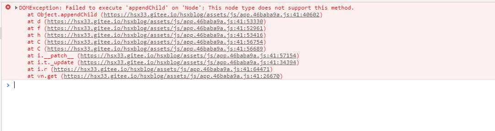
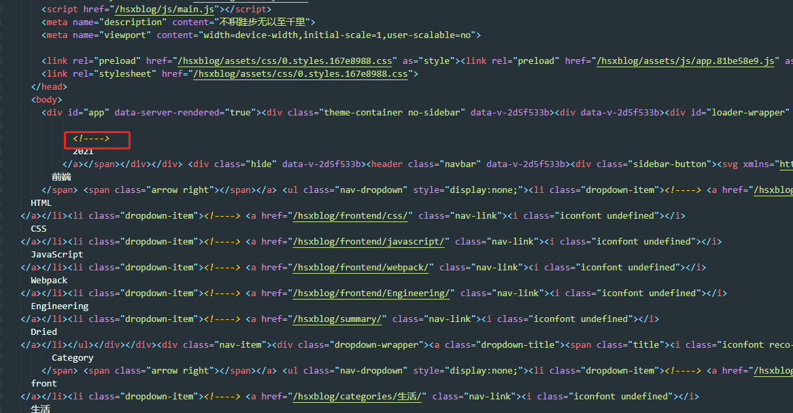

今天遇到一个问题，在 vuepress 打包后部署到生产环境报错：

看抛出的异常：这个节点不支持 `appendChild` 方法。

那不能支持此方法的，第一个想到的是注释节点和文本节点，而我现在碰到的问题是一进到项目里就会报这个错误，导致页面一直在 loading，所以猜测是打包后的 index.html 有问题，打开后的代码如下：

果不其然有很多注释，所以手动删除这些注释果然再次部署后就好了。